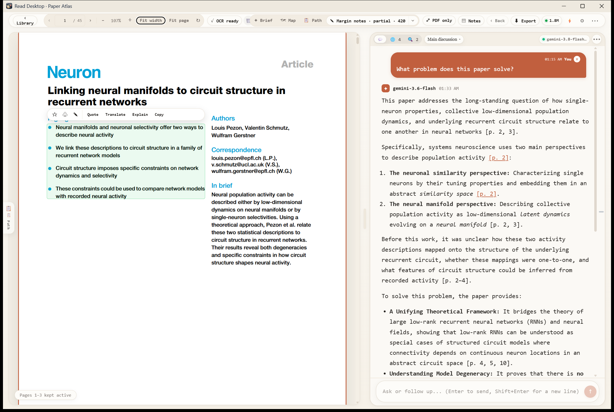
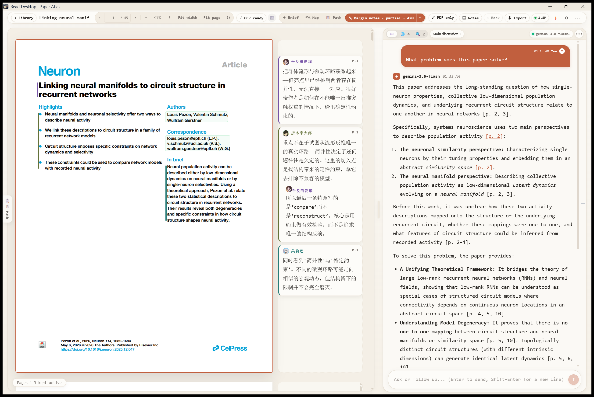
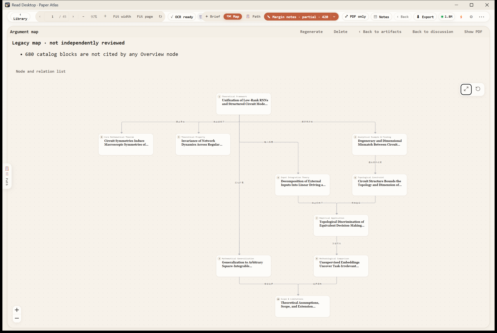
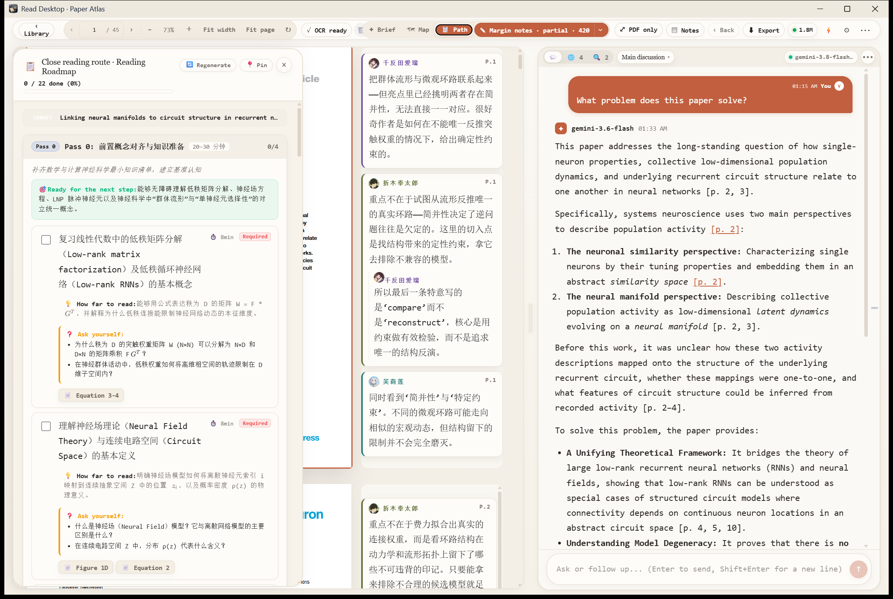
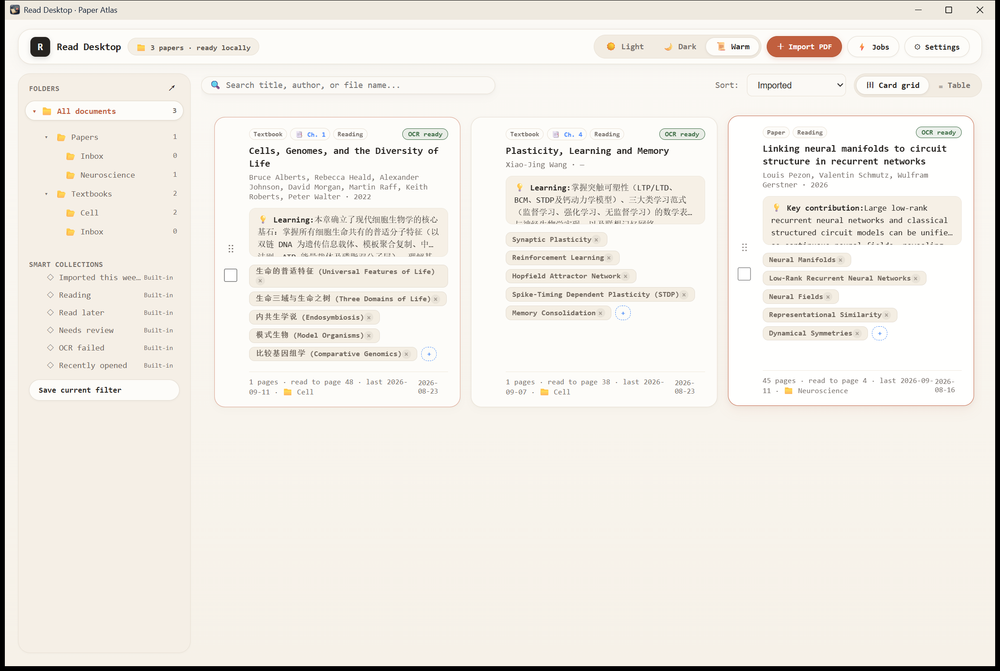

# Read Atlas

[简体中文](README.zh-CN.md) · [User guide](docs/user-guide.md) · [Development](docs/development.md) · [Privacy and costs](PRIVACY.md)

A local-first reading and research workspace for academic papers and textbook PDFs. Organize a library, read the original PDF, and use AI on demand to explain equations, examine figures, plan a reading route, and add margin notes.

**Status: Windows Alpha.** Other platforms are unverified. AI and OCR features require your own provider configuration and API keys; providers charge for usage. See the [release checklist and limitations](docs/release-checklist.md).

## Read, question, and connect ideas

These are captures of the running Windows desktop app with an imported research paper and its existing reading results, taken before the rename from Read Desktop to Read Atlas. Saved content keeps its original language when the interface language changes.

### Select an OCR block and discuss the paper

Click a paragraph, formula, figure, or table in the original PDF. The selection toolbar offers the actions for that block, including quoting it in a discussion, translation, explanation, and Lens analysis where applicable. Keep the paper and your conversation side by side, and follow citations back to the source.



### Read with margin notes

Show precomputed notes beside their source blocks. Character-specific observations stay next to the PDF while the discussion panel remains available for longer questions.



### Explore an argument or knowledge map

See how the paper's ideas, evidence, and conclusions connect. Switch to a full-width map, pan and zoom, select nodes or relations, and open details and source references. The screenshot shows an existing map and its actual review status.



### Follow a close-reading route

Open a reading roadmap without leaving the paper. Work through staged reading tasks, see how deeply to read each topic, use self-check prompts, and jump to the referenced pages or objects. Check off tasks as you progress.



### Organize your local library

Browse papers and textbook chapters by folders, tags, and reading status. Use a card grid or table, filter the library, and select several documents for batch actions.



Additional tools include Briefs, glossaries, symbol tables, artifact versions, recoverable jobs, usage records, themes, editable prompts, and reader background notes.

The paper shown is *Linking neural manifolds to circuit structure in recurrent networks*, by Louis Pezon, Valentin Schmutz, and Wulfram Gerstner ([DOI](https://doi.org/10.1016/j.neuron.2025.12.047)). Screenshots retain the existing document and model-generated content.

## Get started

Download the Windows x64 installer from [Releases](https://github.com/freesky3/read-atlas/releases). The first release is **0.1.1 Alpha** and uses a per-user NSIS installer. It is unsigned, so Windows may display a publisher or SmartScreen warning. Check the included SHA-256 file before installing, and try Alpha builds with a copy of your workspace.

The MSI build is not included in public downloads until its administrator-level installation lifecycle has been validated.

1. Open Settings and select a dedicated workspace.
2. Import PDFs into `Papers/` or `Textbooks/`.
3. For AI features, configure Gemini, Gemini Proxy, OpenAI-compatible, or Grok and run the relevant capability check. Configure Mistral separately for OCR.
4. Open a PDF and explicitly start the OCR or AI feature you need.

**Generating margin notes takes significant time and consumes a large number of tokens.** A notice appears before confirmation. Provider support does not guarantee that every model accepts native PDFs.

### Get your API keys

The model and OCR settings include links to the relevant official provider page. Create a key there, then return to Read Atlas to paste and save it.

| Service | Official key / console page |
| --- | --- |
| Mistral OCR | [Mistral Console](https://console.mistral.ai) |
| Gemini | [Google AI Studio](https://aistudio.google.com/api-keys) |
| OpenAI | [OpenAI API keys](https://platform.openai.com/api-keys) |
| Grok | [xAI API keys](https://console.x.ai/team/default/api-keys) |
| DeepSeek endpoint | [DeepSeek API keys](https://platform.deepseek.com/api_keys) |

Custom compatible endpoints require keys from their own provider. Local proxies use the key configured by the proxy. A key link does not guarantee that the selected model supports native PDFs.

## Run from source on Windows

Install Node.js **24.17.0**, Rust **1.96.1** with the MSVC toolchain, Visual Studio C++ Build Tools, the Windows SDK, and Microsoft Edge WebView2 Runtime. See [development setup](docs/development.md).

From the repository root:

```powershell
npm ci
npm run tauri -- dev
```

`npm run dev` in a browser is an in-memory UI demo. Use the desktop app to verify real files, credentials, OCR, and recovery.

```powershell
npm run check:repo
npm test
npm run build
cargo test --manifest-path src-tauri/Cargo.toml --locked
npm run notices
npm run tauri -- build --bundles nsis,msi
```

## Your data

PDFs, discussions, generated artifacts, and reading state live in your workspace. API keys use Windows Credential Manager. AI features send required material, including the entire PDF for some operations, to the provider you configure. Local storage does not mean local inference.

Read [Privacy and costs](PRIVACY.md). Before upgrading or handling an older workspace, quit the app and back up the entire workspace, including hidden directories. See the [user guide](docs/user-guide.md).

## Contributing

Built with Tauri 2, React / TypeScript, Rust, SQLite, and PDF.js.

[Contributing](CONTRIBUTING.md) · [Documentation](docs/README.md) · [Roadmap](ROADMAP.md) · [Security](SECURITY.md) · [Changelog](CHANGELOG.md)

## License

Original project code and documentation use the [MIT License](LICENSE). Dependencies and other third-party content retain their own licenses and rights; see [Third-party notices](THIRD_PARTY_NOTICES.md). MIT does not grant rights to third-party characters, trademarks, or artwork.
