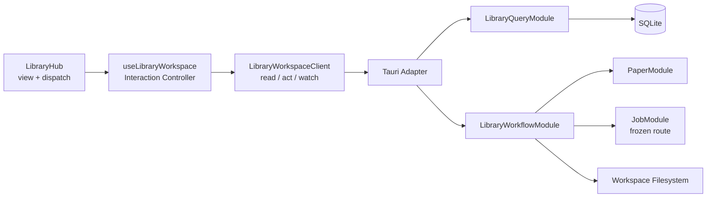

# 文库批量管理、阅读生命周期与拖拽可发现性实施计划

- 状态：**in_progress / PR 0–6 代码已落地；实机 Explorer drop 与 Windows P95 仍属发布门槛**
- 日期：2026-09-03（合同锁定于 2026-08-31；§11.0 按代码事实修订）
- 落地进度见 §11.0。Schema 8、`library_read` / `library_act`、本地 Batch、Reading Lifecycle、Smart Collection、Provider 批量 OCR / Brief 与费用预览、Hub `hub_page` 分页虚拟列表、`chapter` 排序、`collection_layer` 与 Explorer drop 合同已接通。无 Tauri 窗口的环境不能勾掉实机 Explorer / 装包 P95。§1 是实施前审计快照，不要当 HEAD。
- 对应决策：D-063
- 依赖决策：D-053（双根文库）、D-055（跨根改种类）、D-061（Provider 安全路由）、D-062（Hub 精确手排）
- 目标读者：下一位实现 agent、代码审查者、产品验收者

> 本文是切片与 Gate 合同。PR 0–6 的**实现现状、文件入口、踩坑**以 [library-workspace.md](library-workspace.md) 为准，不要只读本节标题里的历史「尚未开始」。动手前先读该手册 §0–§2、本文 **§11.0**、[Hub 排序](hub-sort.md)、[数据协议](data-protocols.md)、[后端加固](backend-hardening.md) 和根目录 [CONTEXT.md](../CONTEXT.md)。

## 0. 执行结论

下一阶段不是在 `LibraryHub.tsx` 继续叠加按钮和回调，而是建立一个纵向的深 Module，再逐步迁移现有入口：

- 前端只向 `LibraryHub` 暴露 `view + dispatch`；
- 桌面边界收敛为 `read / act / watch`；
- 后端内部由 `LibraryQueryModule` 与 `LibraryWorkflowModule` 隐藏查询快照、批次状态机、文件操作 journal、Job 编排、费用预览和补偿撤销；
- Selection Set 保持瞬时，提交时才冻结为 Selection Snapshot；
- Reading Lifecycle 与现有 Reader Session State 分离；
- Smart Collection 保存版本化查询，不复制 Paper；
- 多目标本地操作和付费操作都产生持久 Batch 与逐项结果；
- D-062 的“物理叶子文件夹完整精确置换”继续是不可破坏的不变量。

必须先做可靠快照和聚合投影，再做“全选当前筛选结果”。当前文库 cursor 只由集合、Paper 和冲突的数量拼成；同数量替换、标签变化、生命周期变化都可能不改变 cursor。当前 `list_documents` 又逐篇查询 Brief、OCR、标签与章节，100 篇以后会形成明显 N+1。直接先堆多选 UI 会得到一个既可能选错对象、又会随规模变慢的实现。

## 1. 已审计的现状（实施前快照，2026-08-31）

> **本节是动手前的审计，不是 HEAD。** 表里的「没有批次 / 没有 Snapshot / 逐篇 N+1 / cursor 由数量拼接」均已被 PR 1–6 取代。落地后的事实以 **§11.0 后半（PR 3–6 表）** 和 [library-workspace.md](library-workspace.md) §0 为准。

| 能力 | 当前事实 | 缺口 / 风险 |
| --- | --- | --- |
| PDF 导入 | `App.tsx` 文件选择器 `multiple: false`；后端单文件导入具备 staging、hash、冲突保护 | 没有批次、逐项结果、外部文件拖入和重启恢复 |
| Hub 选择 | `src/library/selectionModel.ts` 的 Selection Set：显式 ids、Shift anchor、focus、all-matching 与排除项，由 `useLibraryWorkspace` 持有 | 提交时仍没有后端 Selection Snapshot（PR 1 的 `queryDigest` / revision vector 不存在），因此 all-matching 不可提交、批量动作不可执行 |
| 内部拖拽 | Pointer 引擎 + 把手启动、插入线只在合法落点、`not-allowed` 与 `aria-live` 原因、`Alt+↑/↓` 与菜单共用 `planReorder` | reorder 结果只影响当层顺序；批量移动 / 标签 / 回收站仍逐项走单篇 IPC，没有批次 |
| 手动排序 | 后端要求物理 collection 全部 live Paper 的精确置换 | 前端只有一处 `planReorder` 守卫，新增入口无法绕开；搜索 / 「全部」/ 含子孙视图已禁提交 |
| 文件夹树 | `treeModel.ts` 按 `parentId` 建树，箭头只折叠、行只选择，展开状态按 `workspaceId + uiSchemaVersion` 记忆 | 仍内联在 `LibraryHub.tsx`，未独立成组件；无虚拟化（PR 6 规模门槛） |
| 标签 / 移动 / 删除 / 导出 | 单篇浅 IPC 与 `LibraryHubProps` 回调 | `App.tsx` 与 Hub 会继续膨胀；标签“覆盖完整数组”会产生 lost update 风险 |
| OCR / Brief | 已进入 durable Job，冻结 Provider route，并有 authoritative retry disposition | 批量层不能另造 Provider 调用或第二套限流器 |
| 阅读状态 | `reading_states` 保存页码、缩放、布局、草稿等工作台恢复信息 | 不能把收藏、已读、复习日期继续塞进同一概念；`lastReadPage` 投影也不可靠 |
| 撤销 | 搬家后仅有 8 秒前端 Toast，直接反向调用移动 | 不持久、不校验并发修改、不等待撤销结果，重启后消失 |
| 文库投影 | Paper 逐篇重开数据库读取摘要 / OCR / 标签 / 章节 | 100+ Paper 后 N+1 比 React 渲染更早成为瓶颈 |
| 文库 cursor | 由数组数量拼接 | 无法证明“全选当前结果”没有漂移 |

## 2. 产品目标与非目标

### 2.1 本阶段必须交付

1. 多文件选择与从 Windows Explorer 拖入 PDF。
2. Ctrl/Shift 多选、全选当前筛选结果、清晰的批量工具栏。
3. 批量导入、移动、标签 patch、回收站、导出、生命周期更新。
4. 批量 OCR / Brief 的资格检查、费用预览、明确确认、逐项 Job 状态。
5. 部分失败只重试合格失败项；取消剩余项；本地动作可整批补偿撤销。
6. 未读 / 阅读中 / 已读、收藏、优先级、稍后阅读、进度、复习日期、最近打开。
7. 内置与用户保存的 Smart Collection。
8. 现有拖拽的把手、投放高亮、插入线、无效原因、显式菜单、键盘替代和 coach mark。
9. 真正可折叠、可聚焦并按 Workspace 记忆展开状态的目录树。
10. 100、1,000 Paper 规模下没有逐卡 IPC / N+1，选择与筛选保持即时反馈。

### 2.2 本阶段明确不做

- 非 PDF、递归导入整个目录、跨 Workspace Batch。
- 文库全文 / 向量搜索、多论文上下文和跨论文 Chat。
- Smart Collection 物化成员、成为磁盘目录、成为拖放目标或参与手排。
- 搜索结果子集手排、跨 collection 全局 permutation、从文件名猜章节号。
- 自动 OCR、后台静默付费、无用户确认的未知费用任务。
- 承诺 Provider 费用可撤销或批量文件操作“全有或全无”。
- 仅凭阅读百分比自动标为已读。
- 永久删除；批量删除仍进入现有回收站语义。

## 3. Design It Twice：三套 Interface 的比较

| 方案 | Interface | 优点 | 主要代价 | 结论 |
| --- | --- | --- | --- | --- |
| A：最小协议 | `read / act / watch`，所有动作使用版本化判别联合 | 外部面最小，易做 Tauri / Memory 双 Adapter，变化集中 | `LibraryIntent` 较大，必须穷尽匹配，不能退化成万能 JSON | **采用为桌面边界** |
| B：显式 Workflow | `plan / start / control / get` + 内部 `BatchActionStrategy` | 费用确认、状态机、恢复和补偿最清晰，适合 Rust 测试 | 直接暴露给 React 会产生较多调用编排 | **采用为后端内部 Module** |
| C：调用方优先 | `LibraryHubBinding { view, dispatch }` | `LibraryHub` 和 `App` 不再了解几十条 IPC；最适合 UI | Controller 本身会较大，需要严格分离纯 Selection / Drop reducer | **采用为前端 Interface** |

最终使用分层混合，而不是在三者中硬选一个：



这个 Module 通过 deletion test：如果删掉它，选择解析、陈旧检测、批次状态、逐项错误、文件补偿、费用确认、Job coalescing 与重启恢复都会重新散落到 `App.tsx`、`LibraryHub.tsx` 和多个 Tauri command，说明它具有足够的 Depth、Leverage 与 Locality。

## 4. 推荐 Interface

### 4.1 `LibraryHub` 只学习一个 Binding

```ts
type LibraryHubBinding = Readonly<{
  view: LibraryHubView;
  dispatch(intent: LibraryHubIntent): Promise<void>;
}>;
```

目标调用形状：

```tsx
const hub = useLibraryWorkspace({
  client: libraryWorkspaceClient,
  navigate,
  notify,
});

return <LibraryHub binding={hub} />;
```

落地形态：`LibraryHub` 内部调用 `useLibraryWorkspace` 消费 `view + dispatch`；`App.tsx` 仍注入 `libraryClient`、树计数用的 `list_documents` / `list_collections`，以及无 client 时的浅 IPC 回退。不要再往 `App.tsx` 堆批次编排。

### 4.2 桌面 Seam：三个入口

```ts
interface LibraryWorkspaceClient {
  read(request: LibraryReadRequest): Promise<LibraryReadResult>;
  act(request: LibraryActRequest): Promise<LibraryActResult>;
  watch(
    after: LibraryRevision | null,
    listener: (event: LibraryEvent) => void,
  ): Promise<{ currentRevision: LibraryRevision; unsubscribe: Unsubscribe }>;
}
```

Tauri 对应 `library_read`、`library_act` 和既有 `read-event` 事件（不另造 `library://changed`）。`read`/`act` 请求都带 `protocolVersion: 1`；每次改变状态的请求带调用方生成的 `idempotencyKey`。

`LibraryActIntent` 必须是 Rust / TypeScript 两侧穷尽匹配的判别联合，第一版至少包含：

```ts
type LibraryActIntent =
  | { kind: "change"; change: LibraryChange }
  | { kind: "plan_batch"; command: BatchCommand; target: BatchTarget }
  | { kind: "start_batch"; batchId: string; planDigest: string; approvals: BatchApprovals }
  | { kind: "control_batch"; batchId: string; control: BatchControl }
  | { kind: "record_reader_activity"; activity: ReaderActivity };
```

禁止使用 `{ command: string, payload: any }`。现有浅 IPC 在迁移期可以由 Adapter 调用，完成迁移后再删除，不做一次性大爆炸重写。

### 4.3 后端内部 Workflow Interface

```rust
trait LibraryWorkflowModule {
    fn plan(&self, request: PlanBatchRequest) -> Result<BatchPlan, WorkflowError>;
    fn start(&self, request: StartBatchRequest) -> Result<BatchProjection, WorkflowError>;
    fn control(&self, request: ControlBatchRequest) -> Result<BatchProjection, WorkflowError>;
    fn get(&self, request: GetBatchRequest) -> Result<BatchProjection, WorkflowError>;
}
```

Import、Move、PatchTags、Trash、Export、OCR、Brief、PatchLifecycle 由内部 `BatchActionStrategy` 实现 `preflight / execute / compensate`。PaperModule 继续拥有路径、hash、移动、回收站等安全规则；JobModule 继续拥有 Provider route、dedupe、并发、attempt 和重试权威。Workflow 只负责编排，不复制它们。

## 5. 领域模型与不变量

### 5.1 Selection Set 与 Selection Snapshot

```ts
type SelectionSet =
  | {
      mode: "explicit";
      viewKey: string;
      ids: ReadonlySet<string>;
      anchorId: string | null;
      focusedId: string | null;
    }
  | {
      mode: "all_matching";
      viewKey: string;
      query: LibraryQuery;
      querySnapshot: {
        queryDigest: string;
        dependencyRevisions: QueryRevisionVector;
        evaluatedAt: string;
        timezone: string;
      };
      excludedIds: ReadonlySet<string>;
      anchorId: string | null;
      focusedId: string | null;
    };
```

不变量：

- Selection Set 只在前端内存，切换物理 / 智能集合或改变筛选表达式时清空，并给出轻量提示；仅切换网格/表格或排序时保留所选 ID、清除失效 anchor。
- Shift 范围基于当前可见稳定顺序；Ctrl/Meta 切换；输入框聚焦时 `Ctrl+A` 保持文本全选。
- Hub 聚焦时 `Ctrl+A` 进入 `all_matching`，语义是当前 query 的全部结果，不逐项 setState；逐项取消写入 `excludedIds`。
- Query compiler 返回 dependency mask；Snapshot 只携带该 query 依赖的 structure / tags / lifecycle / engagement / artifacts / jobs 等 domain revision。无关 OCR 完成或无关 Reader 活动不能让选择失效。
- 相对时间谓词使用后端给出的 `evaluatedAt + timezone`，因此“本周 / 需要复习”按用户看到结果时的时间锚点解析，而不是在点击确认时悄悄换成员。
- `plan()` 使用 `BEGIN IMMEDIATE`：校验相关 revision、解析目标、计算每种动作的 canonical precondition digest、写 Batch / Items / idempotency receipt 后一次提交；不得先 read transaction、再另开 write transaction。
- Selection Snapshot 冻结 `paperId / revisionId / ordinal`；Move、Tag、Trash、Lifecycle、Export 等各自冻结所依赖字段的 digest，不假设所有 Paper 都已有统一 `entityVersion`。
- 相关 dependency revision 或 `queryDigest` 过期时返回 `stale_selection`；Start / execute 再按 Item precondition digest 检查实际依赖，绝不静默包含后来出现的 Paper。
- Batch 创建后 membership 固定；用户之后改变筛选或选择不影响它。
- 逻辑上的 `all_matching` 不参与直接拖拽；这类大范围操作必须从批量工具栏预览后执行。

### 5.2 Batch 与 Batch Item

```text
Execution / Retry / Compensation Batch:
planned → queued → running
                 ↘ paused | action_required | interrupted_unknown
                 ↘ completed | completed_with_errors | failed | cancelled

Batch Item:
planned → queued → running
                 ↘ paused | action_required | interrupted_unknown
                 ↘ succeeded | failed | skipped | cancelled
```

不变量：

- Batch、Batch Item、计划摘要、费用快照、父子关系和补偿信息都持久化。
- 原执行 Batch 与原 Item 到达终态后永远不改写。Retry 使用 `relation='retry'` child Batch；Undo 使用 `relation='compensation'` child Batch。父 Projection 只派生 `retrySummary / compensationSummary`，不把原 `completed/succeeded` 改成 `undone`。
- Item state 是权威；`library_batches.state` 是事务内重算的缓存，启动 reconcile 必须能由 Items 修复，前端不得任意写入。
- Item 逐项终结；某一项失败不得回滚或隐藏其他项的成功。
- `retry_failed` 创建 child Batch，父 Batch 保留原历史；只复制 `failed && retryable` 项。
- 同一 Batch 不允许重复 target key；结果始终按持久 ordinal 展示。
- 同一个 idempotency key + 同一个请求返回原结果；同 key + 不同请求返回 `idempotency_conflict`。
- 本地文件操作使用逐项 operation journal 和幂等 reconcile，不假装存在跨 SQLite / 文件系统事务。

Job 到 Item 的无损映射：

- Job `paused` 且存在 Provider requirement → Item `action_required`；
- 普通暂停 → Item `paused`；
- Job `interrupted_unknown` → Item 同名状态，不能吞成普通 failed；
- possible-charge 是 failed Item 的 authoritative retry disposition，不是前端猜出的新状态。

Aggregate truth table 按以下优先级计算：

1. 未 start → `planned`；
2. 任一 running → `running`；否则任一 queued → `queued`；
3. 任一 `interrupted_unknown` → 同名；否则任一 `action_required` → 同名；否则任一 paused → `paused`；
4. 全 cancelled → `cancelled`；全 failed → `failed`；
5. terminal items 中同时存在 succeeded/skipped 与 failed/cancelled → `completed_with_errors`；
6. 其余全 terminal（含全 skipped）→ `completed`。

`cancel_requested_at` 投影为 `isCancelling`，不是覆盖上述历史的另一终态。

### 5.3 Reading Lifecycle、Engagement 与 Reader Session State

三者必须分开：

- `ReadingLifecycle`：Paper 级，保存 status、favorite、priority、readLater、reviewAt；跨 revision 保留。
- `ReadingEngagement`：Paper + revision 级，保存 firstOpenedAt、lastOpenedAt、furthestPage、pageCountSnapshot。
- `ReaderSessionState`：现有 `reading_states`，保存当前页、偏移、缩放、旋转、布局、草稿等恢复状态。

规则：

- 无 lifecycle row 等价于 `unread / false / priority 0`，旧库不批量回填。
- 第一次真正打开 Reader：`unread → reading`，记录 first / last opened。
- `furthestPage` 在同 revision 内单调不减；返回前页不降低进度。
- `read` 由用户显式标记，或在读到末页时由 UI 询问；不按 90% / 95% 静默完成。
- 显式已读不会因重新打开第一页降级；标记未读也不伪造或清除实际 engagement。
- head revision 改变后 Lifecycle 保留；新 revision 进度从未知开始，旧 engagement 不删除。
- 最近打开只由 Reader open/activity 更新，缩放、草稿保存等 `reading_states.updated_at` 不得污染它。

### 5.4 Smart Collection

- 只保存 `queryVersion + query AST + name`，禁止保存 raw SQL 或成员 ID。
- AST 由后端编译为参数化 SQL；排序必须以 `paper_id` 作为最终稳定 tie-breaker。
- 相对日期（如 `this_week`）在 query 中保存语义与 timezone，不能在保存时固化成某一天。
- “OCR 失败”定义为：当前 revision 没有 ready OCR，且当前 revision 的最新 OCR Job 失败；历史 revision 的失败不计入。
- Smart Collection 不是物理 Collection：不能接收拖放、不能手排、不能成为 Move destination。

首批内置集合：

1. 本周导入但未读；
2. 阅读中；
3. 稍后阅读；
4. 需要复习（`reviewAt <= now`）；
5. OCR 失败；
6. 最近打开。

### 5.5 Manual Reorder

D-062 继续成立：

- 只在单个物理叶子 collection、空搜索、成员完整时可用；
- Pointer 拖拽、`Alt+↑/↓`、移到最前/最后和多选块移动都必须先构造该层全部 live Paper 的完整精确 permutation；
- 搜索、Smart Collection、“全部”、混合子孙视图中不得提交 reorder；
- 多选块重排保持块内相对顺序；所选对象不全在同一可手排 collection 时禁用并说明原因。

### 5.6 Provider 与 Job

- Workflow 不读取 Key、endpoint scope、route ID 或完整 Base URL，不直接调用 Provider。
- Plan 调用 `JobModule::prepare_exact(...)`，由 JobModule 持久化冻结 route/spec 并返回不透明 `PreparedJobHandle`。Batch Item 只保存 handle，不把 route snapshot 塞入 `plan_json`。
- Prepared handle 与 Batch Plan 同时过期；放弃 / 过期 Plan 由 JobModule release。Handle 不创建可 claim Job、不占并发槽；Start 时只能 exact bind，不能回退到“当前 Provider”。
- Start 通过 JobModule 的事务内 Interface 在同一个 `BEGIN IMMEDIATE` 中完成 consume handle、enqueue/coalesce、写 created/joined link 和把 Item 置 queued，提交后才唤醒 worker。不得沿用“先 enqueue commit、再写 link”的两步窗口。
- OCR 使用冻结 Mistral route；Brief 使用冻结 Paper route；每个 Item 关联一个独立 durable Job 或精确 joined Job。
- Job dedupe 可能让一个 Job 被多个 Batch Item 共享，因此不能只在 `jobs` 上加单一 `batch_id`。
- 使用多对多 link 记录 `created` / `joined`、consumer state、费用归属和安全 Job/Receipt snapshot；一个 Job 最多一个 created owner。取消 Batch 时：queued Item 可取消；running Item 尽力停止；共享 Job 只能 detach 本消费者，不能伤害其他活跃消费者。
- created owner 归属 Usage Receipt；joined Batch 显示“复用现有任务，无新增归属费用”，但保留 Receipt 引用。Plan 后若 coalesce 只会降低边际估算，可以记录后继续；估算上升或从 known 变 unknown 必须重新确认。
- Provider 结果的本地 head 只有在仍由该 Item 产生、未被后续修改且没有其他活跃消费者依赖时才可补偿。
- 所有 worker 必须在 Provider commit 前和 Artifact head 发布前重新检查取消状态。
- Provider 已提交后，取消与撤销都不能承诺费用退回。

## 6. UI 与交互合同

### 6.1 Hub 信息架构

侧栏分成两个明确区域：

1. **物理目录**：Papers / Textbooks 的真实树，可展开、选择、作为安全拖放目标；
2. **智能集合**：内置与用户保存的查询，使用不同图标与说明，永远不伪装成文件夹。

主区域由搜索 / 筛选 / 排序栏、Paper 列表、选择工具栏组成。现有任务中心增加“批次”分组，不另造一个与 Job 竞争的第二任务中心。

### 6.2 卡片、选择与打开

- 保留高频路径：普通单击卡片正文打开 Reader，不改成只能双击。
- 卡片 / 表格行新增可见复选框；复选框、Ctrl/Meta+单击、Shift+单击用于选择，普通点击正文仍打开。
- `Space` 切换焦点 Paper 的选择；`Enter` 打开焦点 Paper；`Escape` 清空选择或关闭当前批量浮层。
- 右键未选 Paper 时先把操作上下文切到该 Paper；右键已选 Paper 时作用于当前 Selection Set。
- 列表容器使用 `role="listbox"` + `aria-multiselectable="true"`，卡片 / 表格行使用 `role="option"`、roving `tabIndex` 和 `aria-selected`；所有 focus 状态必须可见。
- 一旦选择非空，顶部显示粘性工具栏：数量、全选当前结果、移动、标签、生命周期、OCR、Brief、导出、移入回收站、清空选择。
- 切换 collection / Smart Collection / 筛选表达式时清空选择并提示“筛选已变化，已清空旧选择”；仅网格 / 表格切换不清空。

### 6.3 内部拖拽

- 继续使用现有 Pointer 引擎、8px 阈值和边缘自动滚动，不改成 HTML5 DnD。
- hover 或 keyboard focus 时显示 `⋮⋮` 把手和 Tooltip“拖动排序或移动”；只有把手启动内部拖拽，避免与打开 / 选择冲突。
- 拖动已显式选中的 Paper 时移动整个显式 Selection Set；拖动未选 Paper 时只移动它。逻辑上的 `all_matching` 不能直接拖。
- 进入有效文件夹目标时整行高亮；进入有效 reorder 位置时显示高对比水平插入线；落在列表 gutter 时明确显示末尾插入线。
- 无效目标显示 `not-allowed` cursor、短原因和 `aria-live` 文案，不能只是不响应。
- 拖入文件夹继续遵守同根快捷规则；跨 Papers / Textbooks 的 kind change 只能走“移动到……”预览对话框。
- 搜索状态可以拖入物理文件夹，但禁止 reorder，并显示“搜索结果不是完整顺序，请清除搜索后排序”。
- Smart Collection 永远不是 drop target，原因是“智能集合由规则生成，不是目录”。

统一的 `DropEvaluation` 必须供拖拽、菜单和键盘复用：

```ts
type DropEvaluation =
  | { allowed: true; action: DropAction }
  | {
      allowed: false;
      reason:
        | "search_reorder_disabled"
        | "not_manual_mode"
        | "incomplete_collection"
        | "mixed_roots"
        | "same_destination"
        | "descendant_folder"
        | "smart_collection_not_destination"
        | "kind_change_requires_dialog"
        | "all_matching_drag_unsupported"
        | "no_destination";
      label: string;
    };
```

`no_destination` 是 PR 2 实现时补上的第十个原因码：落点尚未解析（舞台空白但当前没有选中物理目录、`target.type === "none"`、或路径没有 `Papers` / `Textbooks` 根）时也必须给出可见原因，不能静默不响应，否则与「错误被吞掉」不可区分。

### 6.4 显式菜单与键盘替代

- 右键 / `…` 菜单：移动到……、移到最前、移到最后、标签、阅读状态、导出、回收站。
- `M` 打开 Move 对话框；只在 Hub 有焦点且输入框 / Modal 未聚焦时生效。
- `Alt+↑/↓` 在合法 manual collection 内移动单项或所选块，并提交完整 permutation。
- Move 对话框支持搜索物理目录、展示不可用原因、预览跨根 kind change；不显示 Smart Collection 为目标。
- Toast 使用后端结果，例如：“已移动 83 篇到「To Read」；2 篇失败。查看详情 / 撤销整批”。不得在撤销完成前显示“已撤销”。

### 6.5 真正的目录树

- 通过 `parentId` 构建树，不再按路径全量平铺。
- 箭头按钮只负责 expand/collapse；目录行负责选择；tree / treeitem 使用 roving focus 与 `aria-expanded`。
- `←/→` 收起 / 展开，`↑/↓` 移动焦点，`Enter` 选择目录。
- 展开状态按 `workspaceId + uiSchemaVersion` 存 localStorage；加载时删除已不存在的节点，切换 Workspace 不串状态。
- 首次升级显示一次 coach mark，依次指出复选框、拖拽把手、批量工具栏和 Move 快捷键；版本化记忆，设置中可重新播放。

### 6.6 Windows Explorer 拖入

- 使用 Tauri Webview 的 `onDragDropEvent` 获取 `paths`；外部文件拖入与内部 Pointer 拖拽是两个 Adapter，不能混成 HTML5 DnD。
- `enter / over` 时显示全局 Import overlay 和目标物理目录；`drop` 后只接受普通 PDF 文件。
- 落在物理目录行上时使用该目录（`importDestinationFromHit`，根落到 `{Root}/Inbox`）；落在主列表时使用当前物理目录；当前是“全部”或 Smart Collection 时必须先选择 Papers / Textbooks 目标，不能猜目录。
- 目录、非 PDF、丢失路径和重复路径进入 Item 级 `skipped/failed` 结果，不能在前端先滤掉 PDF 以外的 path 让整批无反馈消失。
- 同一次最多 500 个 source；超过时先提示并要求分批。hash/copy 默认并发 2，仍由后端流式处理。
- Webview listener 必须在组件卸载 / Workspace 切换时 unlisten。

## 7. Batch 行为矩阵

| 操作 | 计划内容 | 开始前确认 | 执行 / 并发 | 撤销语义 |
| --- | --- | --- | --- | --- |
| Import PDFs | source identity、PDF 资格、目标目录、重名 / hash 冲突、既有 Paper effect | 有冲突、restore 或超过阈值时 | 后端 staging + 流式 hash/copy，并发 2 | 只对 `created_new` 默认生成回收站补偿；从不删除用户源文件 |
| Move | 当前路径、目标、同根 / 跨根、kind-change 影响 | 跨根、冲突、部分不可执行 | 逐项复用 PaperModule | 保存 before path；新位置未再次变化时补偿 |
| Patch Tags | `add/remove` 与冲突后的最终集合 | 通常自动开始 | 单事务可批量写入 | 保存 before-image；有版本冲突则该项撤销失败 |
| Trash | 回收站资格、活跃 Job / 远端副作用提示 | destructive 确认 | 逐项复用现有 Trash 合同 | Trash entry 仍在且原路径可用时 restore |
| Export | 格式、目标、命名与覆盖策略 | 覆盖 / 不可逆影响确认 | 有界并发、逐项结果 | 仅删除本 Batch 新建且 digest 未变化的输出；否则不可撤销 |
| Patch Lifecycle | patch、旧 version、最终值 | 通常自动开始 | 单事务批量 patch | 保存旧值并校验当前 version |
| OCR | 当前 revision、已有 OCR、冻结 Mistral route、长 PDF、费用 | 已知 / 未知费用与长 PDF 一次性确认 | 每项独立 Job；并发由 JobModule 管理 | 未提交可取消；已提交费用不可撤销 |
| Brief | OCR / revision 资格、冻结 Paper route、模型、费用 | 已知 / 未知费用与依赖确认 | 每项独立 Job；并发由 JobModule 管理 | 同 OCR；最多安全恢复本地旧 head |

标签必须使用 `add/remove` patch，不再让批量调用方发送“读出后覆盖完整 tags 数组”。所有跨根 Move Item 都单独列出会摘除的成果类别，确认页汇总数量并允许展开查看。

Import Item 的 result 必须区分：

```text
created_new | reused_existing | restored_existing | conflict | skipped
```

- 只有 `created_new` 默认可补偿为“移入回收站”。
- `reused_existing` 不产生补偿；撤销绝不能伤害导入前已存在的 Paper。
- `restored_existing` 只有在 Plan 已明确提示、保存原 Trash before-image 且没有后续修改时，才能补偿回原 Trash 状态。
- 同一 input 内重复 canonical source 仍保留独立 ordinal Item；第一项可执行，之后的重复项预检为 `skipped_duplicate_source`。Source target key 包含 ordinal，并另存 `dedupe_key`；Paper target 仍按 Paper ID 强制唯一。

PatchTags 与批量 Lifecycle 等纯 SQLite 动作使用一个 `BEGIN IMMEDIATE`，每个 Item 一个 SAVEPOINT。单项失败只 rollback 到该 SAVEPOINT，Item 结果与成功业务写在同一外层事务提交；超大批次允许按固定 chunk 重复这一规则。

### 7.1 取消

- `cancel_remaining` 立即把尚未开始的 Item 标为 cancelled。
- running 本地 Item 在安全 checkpoint 停止；已经完成的 Item 保留 succeeded。
- Provider Job 在 commit 前可以取消；commit 后只能请求停止并明确“可能已经产生费用”。
- joined 的共享 Job 只解除当前 Batch 消费者；只有当前 Batch 独占创建且没有其他活跃消费者时才请求取消 Job。
- 只有所有 Item 都 cancelled 时 aggregate 才是 `cancelled`；成功 / skipped 与 cancelled 混合时是 `completed_with_errors`。取消不能伪装成全量回滚。

### 7.2 部分失败重试

- `retry_failed` 默认只选择 `failed && retryable`；用户可以从失败列表进一步勾选。
- 重试创建 child Batch，并通过 `source_item_id` 关联父 Item；父记录不可改写。
- Provider Item 使用 JobModule 的 `retryDisposition`：`safe` 直接计划、`confirm_possible_charge` 再确认、`unavailable` 保持失败并解释。
- 已成功、已跳过、已有活跃 Job 的 Item 不重复执行。

### 7.3 整批撤销

- 撤销创建 `relation='compensation'` 的 child Batch，不做“数据库时间旅行”，也不改写父 Batch / Item 的原终态。
- Undo Token 是单次、不透明、数据库仅存 hash，默认能力窗口 10 分钟；8 秒 Toast 只是快捷入口，任务中心在有效期内继续显示撤销。
- Token 保存 precondition digest。目标被再次移动、重命名、改标签或改状态后，对应 Item 返回 `undo_conflict`，绝不覆盖新操作。
- 部分失败 Batch 只补偿成功且可逆的 Item；Compensation child 可以 `completed_with_errors`，父 Projection 的 `compensationSummary` 显示部分撤销，不创造 `undo_with_errors` 执行状态。
- OCR / Brief 不显示“撤销费用”。付费动作只提供“取消剩余任务”和在安全条件下恢复本地 head。

## 8. 费用预览与确认协议

### 8.1 费用不是一个假精确总数

```ts
type CostPreview = {
  marginalEstimates: Array<{
    confidence: "exact" | "upper_bound" | "estimate";
    currency: string;
    minimum: string; // decimal string
    maximum: string;
    basis: string;
    priceCatalogVersion: string;
  }>;
  unknownItemCount: number;
  unknownReasonCodes: string[];
  joinedExistingJobCount: number;
};
```

- 多币种分开显示，不做隐式汇率换算。
- 自定义 OpenAI-compatible endpoint 缺少价格时返回 unknown，不显示 0。
- OCR 可以按已知页数给出更强估算；Brief 的 token 工作量通常只能给区间或 unknown。
- 最终收费只以 Usage Receipt 为准；预览页明确标注这一点。
- Batch 只汇总 `marginalCostPreview` 与 `attributedActualCost`：created owner 归属 Receipt，joined Item 显示复用且不把同一 Receipt 重复计入多个 Batch 总额。
- 预览阶段不得向 Provider 发请求，只能使用本地已验证 route、文档元数据和版本化价格目录。

### 8.2 Batch Plan 必须冻结

Plan 至少冻结：

- Selection Snapshot、query dependency revisions 与 evaluation anchor；
- 每项 current revision 与该动作的 canonical precondition digest；
- source identity（import 的 canonical path、size、mtime / file identity）；
- destination 与冲突策略；
- Provider 实例的安全摘要、精确冻结模型与 route bind 要求；
- 价格目录版本、工作量假设、已知 / 未知费用；
- kind-change、long PDF、destructive、possible duplicate charge 等具体确认项。

Start 请求不能只带 `confirmed: true`：

```ts
type StartBatchRequest = {
  batchId: string;
  planDigest: string;
  acceptedRequirementIds: string[];
  maximumAcceptedEstimateByCurrency: Record<string, string>;
};
```

Start 时重新验证 target、revision、source identity、destination、exact route bind 与价格版本。任一关键依赖漂移返回 `stale_batch_plan`，UI 必须重新预览，不能静默改目标或费用。`maximumAcceptedEstimateByCurrency` 只是防止确认后估算悄悄上升的本地门槛，不是 Provider 的硬账单上限；确认页必须明确这一点。

## 9. Schema 8 设计

这是一组新的持久化领域，必须正式从 schema 7 升到 8。D-062 的“不升版”只适用于当时两张 Hub Sort 辅助表，不能成为以后偷偷扩表的通行证。

建议核心表如下；最终 SQL 以 migration 与 [数据协议](data-protocols.md) 同步后的定义为准：

```sql
CREATE TABLE library_change_seq (
  singleton INTEGER PRIMARY KEY CHECK (singleton = 1),
  value INTEGER NOT NULL CHECK (value >= 0)
);

CREATE TABLE library_domain_revisions (
  domain TEXT PRIMARY KEY CHECK (
    domain IN ('structure','tags','lifecycle','engagement',
               'artifacts','jobs','smart_collections','sort')
  ),
  value INTEGER NOT NULL CHECK (value >= 0)
);

CREATE TABLE library_action_receipts (
  idempotency_key TEXT PRIMARY KEY,
  request_digest TEXT NOT NULL,
  result_kind TEXT NOT NULL CHECK (
    result_kind IN ('change','plan','start','control','no_op')
  ),
  result_ref TEXT,
  result_json TEXT,
  created_at TEXT NOT NULL
);

CREATE TABLE paper_lifecycle (
  paper_id TEXT PRIMARY KEY REFERENCES papers(id) ON DELETE CASCADE,
  status TEXT NOT NULL CHECK (status IN ('unread','reading','read')),
  favorite INTEGER NOT NULL CHECK (favorite IN (0,1)),
  priority INTEGER NOT NULL CHECK (priority BETWEEN 0 AND 3),
  read_later INTEGER NOT NULL CHECK (read_later IN (0,1)),
  review_at TEXT,
  status_changed_at TEXT NOT NULL,
  completed_at TEXT,
  version INTEGER NOT NULL,
  updated_at TEXT NOT NULL
);

CREATE TABLE reading_engagement (
  paper_id TEXT NOT NULL REFERENCES papers(id) ON DELETE CASCADE,
  revision_id TEXT NOT NULL REFERENCES document_revisions(id) ON DELETE CASCADE,
  furthest_page INTEGER NOT NULL,
  page_count_snapshot INTEGER NOT NULL,
  first_opened_at TEXT NOT NULL,
  last_opened_at TEXT NOT NULL,
  updated_at TEXT NOT NULL,
  PRIMARY KEY (paper_id, revision_id)
);

CREATE TABLE smart_collections (
  id TEXT PRIMARY KEY,
  name TEXT NOT NULL,
  query_version INTEGER NOT NULL CHECK (query_version >= 1),
  query_json TEXT NOT NULL,
  created_at TEXT NOT NULL,
  updated_at TEXT NOT NULL
);

-- JobModule owns this table and never projects frozen_route_json to UI.
CREATE TABLE job_preparations (
  id TEXT PRIMARY KEY,
  spec_digest TEXT NOT NULL,
  frozen_route_json TEXT NOT NULL,
  state TEXT NOT NULL CHECK (
    state IN ('prepared','consumed','released','expired')
  ),
  expires_at TEXT NOT NULL,
  consumed_job_id TEXT REFERENCES jobs(id) ON DELETE SET NULL,
  created_at TEXT NOT NULL,
  updated_at TEXT NOT NULL
);

CREATE TABLE library_batches (
  id TEXT PRIMARY KEY,
  command_kind TEXT NOT NULL CHECK (
    command_kind IN ('import','move','patch_tags','trash','export',
                     'ocr','brief','patch_lifecycle','retry','compensation')
  ),
  command_json TEXT NOT NULL,
  state TEXT NOT NULL CHECK (
    state IN ('planned','queued','running','paused','action_required',
              'interrupted_unknown','completed','completed_with_errors',
              'failed','cancelled')
  ),
  plan_digest TEXT NOT NULL,
  target_digest TEXT NOT NULL,
  cost_preview_json TEXT NOT NULL,
  approval_json TEXT,
  parent_batch_id TEXT REFERENCES library_batches(id) ON DELETE SET NULL,
  relation TEXT CHECK (relation IS NULL OR relation IN ('retry','compensation')),
  undo_policy TEXT NOT NULL CHECK (
    undo_policy IN ('none','full','compensating','cancel_only')
  ),
  plan_expires_at TEXT,
  cancel_requested_at TEXT,
  created_at TEXT NOT NULL,
  started_at TEXT,
  finished_at TEXT,
  updated_at TEXT NOT NULL
);

CREATE TABLE library_batch_items (
  id TEXT PRIMARY KEY,
  batch_id TEXT NOT NULL REFERENCES library_batches(id) ON DELETE CASCADE,
  source_item_id TEXT REFERENCES library_batch_items(id) ON DELETE SET NULL,
  ordinal INTEGER NOT NULL,
  target_kind TEXT NOT NULL CHECK (target_kind IN ('paper','source')),
  target_key TEXT NOT NULL,
  dedupe_key TEXT,
  paper_id TEXT REFERENCES papers(id) ON DELETE SET NULL,
  revision_id TEXT REFERENCES document_revisions(id) ON DELETE SET NULL,
  prepared_job_handle TEXT REFERENCES job_preparations(id) ON DELETE SET NULL,
  precondition_digest TEXT NOT NULL,
  state TEXT NOT NULL CHECK (
    state IN ('planned','queued','running','paused','action_required',
              'interrupted_unknown','succeeded','failed','skipped','cancelled')
  ),
  plan_json TEXT NOT NULL,
  result_json TEXT,
  compensation_json TEXT,
  error_code TEXT,
  error_summary TEXT,
  attempt_count INTEGER NOT NULL DEFAULT 0 CHECK (attempt_count >= 0),
  started_at TEXT,
  finished_at TEXT,
  updated_at TEXT NOT NULL,
  UNIQUE (batch_id, ordinal),
  UNIQUE (batch_id, target_key)
);

CREATE TABLE library_batch_job_links (
  id TEXT PRIMARY KEY,
  batch_item_id TEXT NOT NULL REFERENCES library_batch_items(id) ON DELETE CASCADE,
  job_id TEXT REFERENCES jobs(id) ON DELETE SET NULL,
  ownership TEXT NOT NULL CHECK (ownership IN ('created','joined')),
  consumer_state TEXT NOT NULL CHECK (
    consumer_state IN ('active','completed','detached')
  ),
  cost_attribution TEXT NOT NULL CHECK (
    cost_attribution IN ('creator','shared_no_incremental')
  ),
  usage_receipt_id TEXT,
  job_snapshot_json TEXT NOT NULL,
  created_at TEXT NOT NULL,
  detached_at TEXT,
  UNIQUE (batch_item_id, job_id),
  CHECK (
    (ownership = 'created' AND cost_attribution = 'creator') OR
    (ownership = 'joined' AND cost_attribution = 'shared_no_incremental')
  ),
  CHECK (consumer_state != 'active' OR job_id IS NOT NULL)
);

CREATE UNIQUE INDEX one_created_owner_per_job
ON library_batch_job_links(job_id)
WHERE ownership = 'created' AND job_id IS NOT NULL;

CREATE TABLE library_undo_tokens (
  token_hash TEXT PRIMARY KEY,
  batch_id TEXT NOT NULL REFERENCES library_batches(id) ON DELETE CASCADE,
  precondition_digest TEXT NOT NULL,
  state TEXT NOT NULL CHECK (
    state IN ('available','consumed','expired','revoked')
  ),
  expires_at TEXT NOT NULL,
  created_at TEXT NOT NULL,
  consumed_at TEXT
);
```

必须建立 lifecycle / review / last-opened、batch state / parent、batch item state、job link 的查询索引。`library_action_receipts` 覆盖 change / plan / start / control / undo（undo 是 control）并与业务效果在同一事务写入：只缓存成功 / no-op，不缓存可重试的临时错误；同 key 但 request digest 不同必须拒绝。V1 不独立清理 receipt，避免旧请求在 Batch 仍可见时重新执行。

`library_change_seq` 只用于事件总序与 gap recovery；`library_domain_revisions` 用于 query/selection 的精确依赖检查。会影响 Hub 的写入在同一事务递增全局 seq 与相关 domain；例如 engagement 只让依赖“最近打开 / 进度”的 query 失效，OCR Job 完成不让纯目录选择失效。Start 不因无关全局 seq 变化而失败，只重验 Item precondition、prepared handle、价格与 query 相关 revisions。高频 Reader viewport 保存不递增；Engagement 以节流后的业务活动更新。

`job_preparations` 是 JobModule 内部持久化，handle 默认与 Batch Plan 一起在 15 分钟后过期。过期 / 放弃会 release；consume 与 enqueue/coalesce/link 必须同事务。Job 清理后 link 通过 nullable `job_id` 与 `job_snapshot_json / usage_receipt_id` 保留长期审计，不能因 `ON DELETE CASCADE` 丢失归属。

Smart Collection 查询不物化成员；根据 benchmark 再为可白名单谓词增加组合索引。所有 state / relation / policy / ownership 枚举都必须有 CHECK，并由 validator 比对。

### 9.1 v7 → v8 迁移门槛

1. 迁移前生成可恢复数据库备份；迁移在单个事务中创建表、索引、初始 seq 与 schema metadata。
2. lifecycle 不回填，缺行即默认值；内置 Smart Collection 由代码提供，不插入用户表。
3. 同时更新 `PRAGMA user_version = 8` 与 `schema_meta`；任一验证失败必须保持 / 恢复 v7，不得半激活 worker。
4. validator 检查列、FK、CHECK、索引和双版本一致性；未来版本继续 fail closed。
5. 增加真实 v7 fixture、重复打开、故障注入、备份恢复和 future schema 拒绝测试。
6. Hub Sort 两张 schema-7 辅助表继续存在；Schema 8 validator 将其纳入完整签名。

## 10. Read / Act / Watch 协议

### 10.1 `read`

`LibraryReadRequest` 至少支持：

- `hub_page`：query AST、sort、keyset cursor、page size；返回聚合 Paper card、lifecycle、engagement、artifact/job 摘要、capabilities、totalCount、queryDigest、evaluation anchor、dependency revision vector 与全局 Library Revision。
- `batch` / `batch_items`：返回 aggregate 与分页 Item。
- `smart_collections`：返回内置与用户定义。

另支持 `watch_handshake`（只回 current revision）、`collection_layer`（物理叶子全部 live id，给 D-062）、`recent_batches`、`reading_context`。Hub 默认页 100、最大页 200。投影必须由一次有界 SQL 查询 / 少量固定批量查询完成，禁止每 Paper `open_db` 或每卡 IPC。

### 10.2 `act`

安全的单项收藏 / priority 等 `change` 可以原子完成。Import、Move、Tag、Trash、Export、OCR、Brief 和多目标 lifecycle 都走 `plan_batch → start_batch`；Controller 可以对无需确认的小型本地 Batch 自动 start，但后端仍保留计划与审计。

结果只返回 typed projection，不返回原始 SQLite / Provider 字符串。请求级错误至少包括：

```text
stale_selection
stale_library_snapshot
stale_batch_plan
selection_empty
invalid_query
paper_not_found
unsupported_for_scope
exact_permutation_required
smart_collection_not_reorderable
idempotency_conflict
source_missing
source_changed
target_path_conflict
provider_route_unavailable
cost_confirmation_required
possible_duplicate_charge
undo_expired
undo_conflict
not_reversible
workspace_busy
```

Batch 建立后，单项错误写入 Item：`code / retryable / safeSummary / attempt / failedAt`。UI/Event/诊断不得投影 Key、route ID、endpoint scope、完整 Base URL、绝对 source path 或未经脱敏的 Provider error。

### 10.3 `watch`

- 事件只携带 Library Revision、影响域和安全 aggregate，不携带完整 Paper / 路径。
- 前端按 revision 合并事件；发现 gap 或事件早于当前快照时重新 `read`。
- 初次加载必须“先注册并缓冲 event listener，再执行 `read`”；读完后丢弃 `<= snapshot revision` 的事件并重放更新事件。恢复 watch 时通过 `read({kind:'watch_handshake', after})` 返回 current revision；`after < current` 时立即触发 invalidation。
- 单纯给 Tauri ephemeral listener 传 `after` 不构成可靠订阅；没有上述 handshake / buffer 的实现不得通过 Gate。
- 批次进度事件合并到每秒最多 10 次，避免 500 Item 导致 React event storm。
- Workspace 切换后必须取消旧 listener，再建立新 watch。

## 11. 分阶段实施与 PR 切片

### 11.0 落地进度（2026-08-31）

**PR 0（合同与命名）已落地**：根目录 `CONTEXT.md` 词汇表、本计划、D-063、[product-scope.md](product-scope.md) 与 [hub-sort.md](hub-sort.md) 的边界均已同步。PR 0 本身没往 `data-protocols.md` / `feature-specs.md` 写任何 IPC 描述——当时 PR 1 的接口还不存在，写进去就是把虚构合同当生产事实；PR 1 落地后合同细节才补进 [data-protocols.md](data-protocols.md)。

**PR 1（Schema 8 + Query foundation）已落地**：

| 合同条目 | 实现 | 测试 |
| --- | --- | --- |
| §9.1 Schema 8：v7→v8 原子 migration、11 张新表、validator 与故障注入 | `src-tauri/src/v2_workspace.rs`（`migrate_v7_to_v8_with_fault` / `validate_v8_database`，`SQLITE_SCHEMA_VERSION = 8`） | `critical_v8_ddl_faults_roll_back_schema_and_new_tables`、`mixed_future_and_incomplete_v8_databases_fail_closed_without_file_mutation` |
| §9 全局 `library_change_seq` + 8 个 `library_domain_revisions`，同事务推进、缺表 / 缺行 fail closed | `src-tauri/src/library_workflow.rs`（`bump_library_revisions` / `library_revisions` / `dependency_vector`） | `library_workflow::tests` 7 项（含随写事务回滚、pre-v8 库拒绝） |
| §10.1 `read`：Hub 投影改成一次有界聚合查询（逐 Paper 重开数据库的 N+1 已消除） | `src-tauri/src/library_query.rs` | `statement_count_is_bounded_by_the_page_not_the_library`：200 与 1,000 / 10,000 Paper 语句数相同；PR 1 当时恒为 8，PR 4 extras 后为 **11** |
| §10.1 keyset 游标、`queryDigest`、依赖 revision 向量 | `library_query.rs`（游标 = base64url-nopad(`digest`/`key`/`id`)；digest 只覆盖查询 AST，不含游标） | `hub_page_caps_the_default_page_and_walks_the_keyset_without_gaps`、`equal_sort_keys_still_produce_a_total_order`、`manual_order_pages_by_persisted_position`、`query_digest_is_shared_across_pages_and_changes_with_the_ast` |
| §4.2 只读 seam `library_read`（判别联合请求；错误只有 `invalid_query` / `workspace_unavailable`） | `src-tauri/src/lib.rs::library_read` | `invalid_requests_fail_closed_before_any_read`、`unknown_fields_and_protocol_versions_are_rejected`、`hub_page_json_shape_is_camel_case_and_free_of_absolute_paths`、`filters_bind_as_parameters_and_never_as_sql`、`a_library_without_a_revision_counter_fails_closed_as_unavailable` |
| §10.3 watch：事件只是提示，握手才是权威 | `src/library/libraryWorkspaceClient.ts` | 合同测试的两个 handshake 用例 + `job` 事件同样触发一次握手 |
| §5.1 Selection Snapshot 的读侧依据（`queryDigest` + 依赖向量，前端类型已就位） | `src/library/libraryWorkspaceTypes.ts` | `libraryWorkspaceContract.test.ts` 的键集漂移守卫（`PAGE_KEYS` / `CARD_KEYS` / `REQUEST_KEYS` / `PAGE_QUERY_KEYS` / `FILTER_KEYS`） |
| §11 PR 1 前端类型、双 Adapter 与一份共享合同测试 | `src/library/libraryWorkspaceTypes.ts`、`src/library/libraryWorkspaceClient.ts`（Tauri / Memory） | `src/library/libraryWorkspaceContract.test.ts` 25 项：两个 Adapter 跑同一组用例、比对同一份 Rust 生成的字节 `src/library/__fixtures__/library_read_v1.json`（12 case：10 个 `hub_page` + 2 个 `watch_handshake`） |
| §9 写侧证据：同数量内容替换必须推进 revision | `paper_module.rs` 各写点 | `every_hub_visible_write_advances_the_global_revision`（逐个可见写都推进）、`the_hub_cursor_is_the_global_revision_not_a_count_composition`（原位重写 PDF，篇数 / 冲突数不变而游标变）、`rejected_writes_and_viewport_saves_leave_the_revision_untouched` |
| §9 补充不变式：任何移动 `jobs.state` 的写在同一事务推进 `jobs` 域 | `job_module.rs::bump_jobs_state`（15 个写点） | `state_transitions_move_the_jobs_revision_while_progress_writes_do_not` |

合同细节（DDL、bump / no-bump 规则、请求与响应字段、游标与 digest 规则、错误码、fixture 再生成命令）见 [data-protocols.md](data-protocols.md) 的「Schema 8 revision 与 `library_read`（D-063 PR 1）」。

**PR 1 当时未落地的部分**（已被后续 PR 接通，**不要当现状**）：

- `hub_page` 当时只支持 `recent | year | title | manual`，没有 `chapter` → **PR 6** 已加 `chapter` / `last_opened`。
- `LibraryHub` 当时仍读 `list_documents`，`querySnapshot` 恒为 `null` → **PR 3** 填 `selectionDigest`，**PR 6** 卡片走 `hub_page`。
- schema 8 当时只有 revision 计数器有 writer → **PR 3–5** 接通 Batch / Lifecycle / Smart Collection / Job preparations。
- 当时没有 `library_act` → **PR 3** 落地 `plan_batch` / `start_batch` / `control_batch`。

**PR 1 Gate 判定（对照 §「PR 1：Schema 8 + Query foundation」的 Gate）**：

- 「1,000 Paper fixture 无逐 Paper DB open」→ `statement_count_is_bounded_by_the_page_not_the_library`：语句数不随库增大。PR 1 当时恒为 8；PR 4 extras 后 200 / 1,000 / 10,000 均为 **11**。
- 「同数量内容替换会改变 revision」→ 写侧 `the_hub_cursor_is_the_global_revision_not_a_count_composition`（原位重写 PDF，篇数 / 冲突数不变而游标前进）；读侧 `the_page_cache_key_is_the_revision_not_the_digest_or_the_count`（替换后 `queryDigest` 与 `totalCount` 都不变，只有 revision 变）。
- 「Tauri 与 Memory Adapter 共享合同测试」→ `libraryWorkspaceContract.test.ts` 25 项，两个 Adapter 跑同一组用例并比对同一份 Rust 生成的 fixture 字节。
- 「现有单项 UI 行为保持不变」→ 前端全量 `npx vitest run --no-file-parallelism` 53 文件 / 357 测试全绿，含 PR 2 的 `LibraryHub.interaction.test.tsx`；`LibraryHub` 的投影源未被改动。
- 本轮实测数字：`cargo test --locked` 309 通过 / 0 失败，`npx tsc -b` 0 错误，`cargo clippy --locked --all-targets` 相对 HEAD 新增 0 条告警。

**PR 2（前端 Interaction Module + 拖拽可发现性）已落地**：

| 合同条目 | 实现 | 测试 |
| --- | --- | --- |
| §5.1 Selection Set（显式 / all-matching、anchor、focus、排除项） | `src/library/selectionModel.ts` | `selectionModel.test.ts` 22 项 |
| §6.3 统一 `DropEvaluation`（拖拽 / 菜单 / 键盘同一份判定） | `src/library/dropPolicy.ts` | `dropPolicy.test.ts` 21 项 |
| §5.5 唯一 reorder 提交口 `planReorder`（D-062 精确置换只有一处守卫） | `dropPolicy.ts` | 同上，含「拖到自身＝顺序未变化」 |
| §6.5 真实目录树（`parentId` 建树、展开状态按 `workspaceId + uiSchemaVersion` 记忆） | `src/library/treeModel.ts` | `treeModel.test.ts` 13 项 |
| §4.1 Interaction Controller（`LibraryHub` 只学 `view + dispatch`） | `src/library/useLibraryWorkspace.ts` | 由组件测覆盖 |
| §6.2 把手、复选框、插入线、焦点环、aria-live 无效原因 | `src/components/LibraryHub.tsx`、`src/styles.css` | `LibraryHub.interaction.test.tsx` 22 项 |
| §6.4 右键菜单全量动作 + 禁用原因、`HubMoveDialog` 跨根 kind change 预览 | `HubContextMenu.tsx`、`HubMoveDialog.tsx` | 同上 |
| §6.5 首次 coach mark（版本化记忆，设置 →「重新播放」） | `useLibraryWorkspace.ts`、`SettingsWorkspacePage.tsx` | 同上 |

**PR 2 未落地的部分**：目录树仍以子节点形式写在 `LibraryHub.tsx` 内，没有独立成 `HubFolderTree.tsx`；行为合同已由测锁定。抽组件仍可后做，不阻塞批次。

**PR 3（本地 Batch + 多文件导入）已落地**：

| 合同条目 | 实现 | 测试 |
| --- | --- | --- |
| §4.3 / §5.2 / §7 `plan / start / control`、幂等 receipt、Item 权威态、crash reconcile | `src-tauri/src/library_batch.rs` + `library_act` | `library_batch::tests` 48 项（含 500 源、重复 start、部分失败、killed run、corrupt PDF） |
| PatchTags add/remove；Move / Trash / Import / Export 逐项 journal | 同上；Import 结论 `created_new \| reused_existing \| restored_existing \| conflict \| skipped_*` | 同上 |
| §10.1 `batch` / `batch_items` / `recent_batches` | `library_query.rs` 分派到 `library_batch` | `recent_batches_lists_newest_first_and_reconciles_before_projecting`；`batch_items_page_walks_ordinals` |
| §4.2 前端 `act` + 双 Adapter | `libraryActTypes.ts`、`libraryWorkspaceClient.ts`（Tauri / Memory） | `libraryAct.memory.test.ts`；Memory Adapter 覆盖 plan/start/undo |
| §6.2 批量工具栏接通本地动作；OCR / Brief / Lifecycle 仍「即将支持」 | `LibraryHub.tsx`、`useLibraryWorkspace.ts` | `LibraryHub.interaction.test.tsx` PR 3 用例 |
| §5.1 Selection Snapshot：`hub_page.selectionDigest` 填入 `querySnapshot` | `hubFilters.ts` + Hub 读 `hub_page` | `hubFilters.test.ts`；无 snapshot 时 Ctrl+A 仍拒绝提交 |
| §6.6 多文件 picker + Webview drop overlay | `App.tsx` `multiple: true`；Hub `onDragDropEvent` | 组件测覆盖确认流；实机 Explorer drop 属 PR 6 |
| 任务中心批次分组、失败重试、取消剩余、Undo Token 快捷入口 | `OperationsDrawer.tsx` + 8 秒 Toast「撤销整批」 | 后端 undo / retry 测；UI 走同一 `control_batch` |

**PR 3 未落地 / 刻意保留**：

- 目录树未抽成 `HubFolderTree.tsx`。
- 浏览器预览的 Memory Adapter 不模拟真实 hash/copy journal。
- Hub 显示切到分页 `hub_page`、`chapter` 进查询、整层 `collection_layer` 是 PR 6（当时刻意保留 `list_documents`）。

**PR 4（Reading Lifecycle + Smart Collection）已落地**：

| 合同条目 | 实现 | 测试 |
| --- | --- | --- |
| §5.3 Lifecycle / Engagement 与 `reading_states` 分离；无行即默认 unread | `library_lifecycle.rs` + `list_documents` extras | `missing_lifecycle_row_is_unread_defaults` |
| 第一次打开 unread→reading；同 revision furthest_page 单调；显式已读不降级 | `record_activity` / `apply_lifecycle_patch` | `first_open_moves_unread_to_reading…`、`explicit_read_survives_reopening_page_one` |
| 新 revision 不继承假进度 | 同上 | `a_new_revision_starts_progress_unknown_and_keeps_old_engagement` |
| 末页才询问，绝不按 90%/95% 静默完成 | `readerReadingState.ts` + Reader 提示条 | `shouldPromptCompletion`；UI 只在 `isAtEnd` 出现 |
| 六个内置 Smart Collection + 用户保存/重命名/删除 | `library_read smart_collections` / `library_act change` | `builtins_are_not_stored_and_user_collections_round_trip` |
| 相对日期按 evaluation anchor 所在周周一 00:00 UTC | `this_week_start` | `this_week_is_monday_of_the_anchor…` |
| OCR 失败只看 current revision | `QueryFilter::OcrFailed` | `lifecycle_filters_relative_dates_and_ocr_failed_use_the_current_revision` |
| Hub 侧栏智能集合、卡片状态、菜单/批量 PatchLifecycle | `LibraryHub.tsx` | `LibraryHub.interaction.test.tsx` |
| `hub_page` 依赖向量含 lifecycle / engagement | `HUB_PAGE_DEPENDENCIES` 7 域 | `hub_page_reports_the_global_revision_and_only_declared_dependencies` |

**PR 4 未落地 / 刻意保留（当时）**：智能集合在无 client 时仍可用卡片 extras 过滤。Hub 显示切到分页 `hub_page` 是 PR 6。

**PR 5（Provider Batch + 费用预览）已落地**：

| 合同条目 | 实现 | 测试 |
| --- | --- | --- |
| JobModule prepared-job / exact retry；handle 过期 / release / consume | `job_module.rs` `prepare_exact_on` / `consume_prepared_on` | `prepare_exact_does_not_create_a_claimable_job`、`consume_enqueues_and_rejects_a_changed_key`、`rolled_back_prepare_leaves_no_handle_and_no_job` |
| Start 同事务 consume / enqueue / coalesce / link / Item queued | `library_batch.rs` `start_provider_items` | `ocr_start_enqueues_jobs_and_keeps_items_queued`、`existing_ocr_is_skipped_and_second_batch_joins_the_job` |
| 费用预览 exact / estimate / unknown；unknown 不为 0 | `library_cost.rs` | `ocr_with_known_pages_is_exact_and_not_zero`、`custom_endpoint_brief_is_unknown` |
| 长 PDF、切换 Key fail closed、唯一 created owner、取消共享 Job | `library_batch.rs` | `long_pdf_is_a_start_requirement`、`switching_ocr_key_at_start_is_stale`、`cancel_remaining_does_not_cancel_a_shared_job` |
| Hub OCR / Brief 工具栏 + 确认页费用 | `LibraryHub.tsx`、`HubBatchConfirmDialog.tsx` | `LibraryHub.interaction.test.tsx`、`libraryAct.memory.test.ts` |

**PR 5 未落地 / 刻意保留**：Worker 真正打 Provider 仍走现有 JobModule，批次只编排。Memory Adapter 不模拟 Job 并发。Hub 显示切到分页 `hub_page` 是 PR 6。

**PR 6（规模、可访问性与实机发布门槛）已落地（代码）**：

| 合同条目 | 实现 | 测试 |
| --- | --- | --- |
| Hub 卡片走 `hub_page` 分页，无逐卡 IPC | `useHubPageList.ts` + `LibraryHub.tsx` | `LibraryHub.interaction.test.tsx` PR 6；`library_query` 1k/10k statement bound |
| 虚拟列表（>48 项且视口已知） | `virtualWindow.ts`；列表滚动宿主 `.hub-paper-list` | `virtualWindow.test.ts` |
| `chapter` 进 `hub_page`；精确 collection 过滤 | `HubSort::Chapter` + SQLite `chapter_sort_key` | `chapter_sort_orders_segmented_numbers…`；Memory Adapter 同序 |
| D-062 整层 id 不依赖已加载页 | `library_read collection_layer` | `collection_layer_returns_every_live_id…` |
| watch 先 listen 再握手，缓冲窗口事件 | `createTauriLibraryWorkspaceClient().watch` | `buffers events that arrive during the opening handshake` |
| Explorer / picker 同一 Import Batch；500 源上限 | `importDrop.ts` + `App.importPdfPaths` | `importDrop.test.ts`；后端 500 源已在 PR 3 |
| 键盘 / SR：listbox option、setsize/posinset、加载 status、aria-live | `LibraryHub.tsx` | `LibraryHub.interaction.test.tsx` PR 6 |

**PR 6 未落地 / 发布机时门槛**（不得写成已上线）：

- 实机 Windows Explorer 拖入、一次 500 文件、跨根 / 回收站 / 部分撤销 / 关闭重启的**硬件验收**。
- 1,000 Paper Hub warm P95 ≤ 50 ms / cold ≤ 150 ms、10,000 query P95 ≤ 250 ms 的**开发基准机记录**。本 PR 用 debug 语句数不随库增大 + 10k 页读取有界（< 8s debug）代替机时 P95。
- 屏幕阅读器实机念读；jsdom 只锁 role / name / live 区域。

**明确未实现，不得据 UI 推断为已完成**：

- 目录树仍内联在 `LibraryHub.tsx`，未抽 `HubFolderTree.tsx`（行为已测，不阻塞批次）。
- 发布机时：实机 Windows Explorer 拖入、1,000 / 10,000 P95、屏幕阅读器念读。无 Tauri 窗口不得勾掉。

D-063 计划内 PR 0–6 的**代码合同**已落地；剩余是发布机时与实机验收。

**2026-09-03 对照计划修补**（不是新切片；实现手册 [library-workspace.md §11](library-workspace.md)）：

| 缺口 | 修补 |
| --- | --- |
| 多选拖进目录 `showHint("")` 后 return | `commitPaperMove` → Move Batch；跨根仍开对话框 |
| Explorer 只用 `selectedFolder`；前端 `filter(.pdf)` | `importDestinationFromHit`；全部 path 进 Batch |
| `collection_layer` 进夹后不刷新 | 依赖 `hub_page.revision` |
| 任务中心「可撤销」无按钮 | `undoTokenStore` + Drawer「撤销整批」 |
| 卡片不展示 priority / review / lastOpened | 芯片与表格行 |
| 计划 §1 / PR 1「未落地」写成现在时 | 标成实施前快照；事件名改为 `read-event` |

与 §6.3 的偏差：原因码在文档列出的九个之外多一个 `no_destination`（落点尚未解析时不能静默放行），已写入 §6.3 表格。

工期仅用于排序，按一个熟悉 TypeScript / Rust 的开发者估算，不是交付承诺。

### PR 0：合同与命名（0.5–1 天）

改动：

- 本文、根 `CONTEXT.md`、D-063；
- 修订 `product-scope.md` 和 `hub-sort.md` 的旧边界；
- 在实现 PR 开始时同步 `data-protocols.md` / `feature-specs.md`，避免把未存在的 IPC 写成生产事实。

Gate：术语、状态机、取消 / 撤销 / 费用文案无矛盾；D-062 精确置换被显式保留。

### PR 1：Schema 8 + Query foundation（4–6 天）

新增建议：

- `src-tauri/src/library_query.rs`
- `src-tauri/src/library_workflow.rs`（先建立 Interface 与只读骨架）
- `src/library/libraryWorkspaceTypes.ts`
- `src/library/libraryWorkspaceClient.ts`

修改：

- `src-tauri/src/v2_workspace.rs`：v7→v8 migration / validator / fixture；
- `src-tauri/src/paper_module.rs`、`src-tauri/src/lib.rs`：聚合 Hub projection 与单调 revision；
- `src/types.ts`、`src/desktopClient.ts`：Tauri / Memory Adapter 合同。

Gate：1,000 Paper fixture 无逐 Paper DB open；同数量内容替换会改变 revision；Tauri 与 Memory Adapter 共享合同测试。现有单项 UI 行为保持不变。

### PR 2：前端 Interaction Module + 拖拽可发现性（4–6 天）

新增建议：

- `src/library/selectionModel.ts`
- `src/library/dropPolicy.ts`
- `src/library/useLibraryWorkspace.ts`
- 对应纯函数与 hook 测试。

修改：

- `src/components/LibraryHub.tsx`：`view + dispatch`、复选框、焦点、把手、插入线、无效原因、批量工具栏；
- `src/styles.css`：hover / focus / selected / drop states；
- 目录树组件化并保存展开状态。

Gate：Ctrl/Shift/Ctrl+A、Space/Enter/M/Alt、Grid/Table、搜索禁重排、完整 permutation 与屏幕阅读器提示全部组件测通过。此 PR 不要求批量动作真正执行，可在未接通的按钮上显示“即将支持”，但不得发布为完成态。

### PR 3：本地 Batch + 多文件导入（7–10 天）

实现顺序：

1. `plan/start/get/control` 状态机、幂等、逐项 journal 与 crash reconcile；
2. PatchTags（最易验证）；
3. Move / Trash；
4. Import（`multiple: true` + Tauri OS drop）；
5. Export；
6. 任务中心 Batch aggregate、失败项分页、child retry、Undo Token。

Gate：500 source 接受、重复 path/hash、冲突、损坏 PDF、磁盘写失败、进程在 prepared/running/publish 各点退出后均能恢复；局部失败不丢成功结果；重复 start 不重复执行。

### PR 4：Reading Lifecycle + Smart Collection（5–7 天）

实现：

- Lifecycle 与 Engagement 写入 / 投影；Reader open/activity 接线；把单项与批量 PatchLifecycle Strategy 一起接入已存在的 Workflow；
- 卡片状态、收藏、priority、进度、稍后阅读、review date；
- 后端 whitelist query AST、六个内置 Smart Collection、保存 / 重命名 / 删除用户 query；
- Smart Collection capability 明确禁用 manual reorder 与 drop。

Gate：旧 Paper 无 row 时默认正确；同 revision furthest page 单调；新 revision 不继承假进度；时区 / 本周边界 / OCR 失败只看 current revision。

### PR 5：Provider Batch + 费用预览（7–10 天）

实现：

- JobModule 内部 prepared-job / exact retry Interface；
- prepared handle 的过期 / release / consume、同事务 enqueue/coalesce/link、orphan reconciliation；
- OCR / Brief Item 的 route-safe plan、费用快照、unknown、长 PDF 聚合确认；
- `library_batch_job_links` 的 created / joined fan-out；
- cancel checkpoint、provider committed 文案、possible-charge child retry；
- marginal preview、created-owner attributed actual cost、joined no-incremental 展示与 Receipt snapshot。

Gate：切换 Provider / Key、route 不可 exact bind、未知价格、共享 Job、唯一 created owner、enqueue/link 故障注入、commit 前后取消、重启恢复全部 fail closed；预览不发网络请求且不泄露敏感身份。

### PR 6：规模、可访问性与实机发布门槛（3–5 天）

- 100 / 1,000 / 10,000 Paper benchmark 与必要虚拟化；
- Windows Explorer 实机 drag/drop；
- 500 文件、跨根、回收站、部分撤销、关闭 / 重启；
- keyboard-only 与 screen-reader smoke；
- 更新 `data-protocols.md`、`feature-specs.md`、README、handoff 与验证计数。

Gate：本文 Definition of Done 全部满足，旧浅 IPC 只在仍有调用者时保留；删除迁移 shim 前有等价 Interface 测试。

## 12. 测试与验收矩阵

### 12.1 前端纯逻辑

| 场景 | 断言 |
| --- | --- |
| Ctrl toggle | O(1) 增删，不改变无关 ID |
| Shift range | 使用当前稳定可见顺序，anchor 缺失时退化为单项 |
| Ctrl+A | 当前 query 全选，排除项正确；输入框内不拦截 |
| 切换 scope / filter | Selection 清空并提示；Grid/Table 切换保留 |
| 多选块 reorder | 保持块内相对顺序，生成整层完整 permutation |
| 搜索 / Smart Collection reorder | capability false，所有入口给出相同原因 |
| Drop policy | 同根、跨根、self、descendant、same destination、smart target 全覆盖 |
| Tree reducer | 展开、收起、节点消失、Workspace 隔离、键盘 roving focus |

### 12.2 React 组件

- checkbox / modifiers / context menu / bulk toolbar 的焦点与操作对象一致；
- drag handle hover 与 focus 都可见；8px 以内仍是 click，超过才 drag；
- Grid / Table 插入线、folder highlight、invalid live region；
- `M`、`Alt+↑/↓` 在输入框 / Modal 内不误触；
- coach mark 每 UI schema version 只出现一次且可重放；
- OS drop overlay 的 enter/leave/drop 与 unlisten；
- Toast 等待后端成功，partial / undo conflict 不显示全成功。

### 12.3 Rust / SQLite

- v7 fixture → v8 原子迁移、重复打开、失败注入、future schema fail closed；
- `library_change_seq` 覆盖每种 Hub-visible write；同数量变化不漏；
- domain revision mask 只让相关 query 失效；无关 Job/Engagement 变化不阻止 Start；
- query AST 白名单、参数绑定、stable tie-breaker、relative date timezone；
- 一次 query 聚合 lifecycle / engagement / tags / artifact / current Job；无 N+1；
- Batch state 只由 Item 推导；idempotency、duplicate target、ordinal 稳定；
- 原父 Batch/Item 终态不可改写；retry / compensation child 与派生 summary 正确；
- PatchTags / PatchLifecycle SAVEPOINT 保留其他 Item 的成功结果；
- import / move / trash / export 的 prepared / execute / publish crash recovery；
- Import `created_new/reused_existing/restored_existing` 与 duplicate-source skip 的补偿权限正确；
- retry 创建 child；cancel queued/running；Undo Token hash / expiry / single-use / conflict；
- prepared handle expiry/release；enqueue + created/joined link 原子；其他消费者保护、route exact bind；
- Job 清理后 link / cost / result snapshot 仍可审计；
- watch 在 listen/read 窗口收到事件时不丢更新；
- D-062 exact permutation、同层 rename、跨层 move、trash / restore 旧测试保持通过。

### 12.4 付费与恢复

| 场景 | 断言 |
| --- | --- |
| 价格完整 | 显示 exact / range 与版本，start 接受上限 |
| 价格缺失 | unknownCount > 0，绝不显示 0 |
| Plan 后 revision / route / 价格变化 | `stale_batch_plan`，不静默开始 |
| provider committed 前取消 | 不产生新提交；Item cancelled |
| committed 后取消 | 明确可能收费，Usage Receipt 仍归档 |
| retryDisposition possible charge | 必须二次确认；不由前端字符串推断 |
| App 关闭 / 重开 | Batch / Item / Job 关系与 aggregate 可恢复 |
| Undo provider Batch | 不出现“费用已撤销”；仅取消剩余或安全恢复本地 head |

### 12.5 性能预算

- 1,000 Paper：Hub warm query P95 ≤ 50 ms、cold query P95 ≤ 150 ms（开发基准机记录配置）。
- 10,000 Paper：筛选 / Smart Collection query P95 ≤ 250 ms；必要时启用 keyset pagination 与虚拟列表。
- 单项选择反馈下一帧完成；Shift 1,000 项与 Ctrl+A 不产生 1,000 次 React state update。
- 接受 1,000 Item 的 Batch（只建计划 / Item，不做文件或网络工作）P95 ≤ 500 ms。
- Hub 加载无逐卡 IPC、无逐 Paper `open_db`；事件刷新每秒不超过 10 次。
- Import hash / copy 内存保持流式，不随单文件大小线性增长；默认并发 2 可配置但不暴露危险无限并发。

## 13. 风险与防护

| 风险 | 防护 |
| --- | --- |
| 旧 cursor 让全选漂移 | 全局 seq 只排事件；query dependency revision vector + 时间锚点 + `BEGIN IMMEDIATE` 冻结成员 |
| `App.tsx` / Hub 继续膨胀 | 先立 `view+dispatch` 与 read/act/watch Seam，再迁移功能 |
| 文件系统与 SQLite 不能原子提交 | 每 Item journal、幂等阶段、重启 reconcile、诚实 partial result |
| 跨根 Move 摘掉成果 | 每 Item preflight，汇总 kind-change 影响并显式确认 |
| Tag read-modify-write 覆盖并发修改 | add/remove patch + entity version |
| Job coalescing 导致孤儿 / 误取消 / 重复计费 | Prepared handle；enqueue/coalesce/link 同事务；唯一 created owner；consumer state 与费用归属 |
| Provider 费用无法可靠估计 | exact/range/unknown；accepted estimate ceiling 只防计划漂移，不冒充账单上限；Receipt 为最终事实 |
| Cancel 在 commit / publish 竞态 | 两个权威 checkpoint 重新检查取消状态 |
| Undo 覆盖用户后续修改 | Token precondition digest；冲突逐项失败 |
| Smart Query 成为永久协议 | `queryVersion`、白名单 AST、升级器与 fixture |
| `listen → read` 窗口丢事件 | 先订阅缓冲、再 read，watch handshake 返回 current revision，gap 强制重读 |
| 内部绝对路径 / route 身份泄漏 | DB 内部保存恢复所需 locator；IPC、事件、诊断统一脱敏 |
| 新 schema 借 D-062 例外无版本扩张 | 正式 schema 8 ADR、migration、validator、备份 / fail closed |

## 14. Definition of Done

只有同时满足以下条件，才可以把本文状态改为 implemented：

- 多文件 picker 与 Explorer drop 都产生同一种持久 Import Batch；
- Ctrl/Shift/Ctrl+A、键盘焦点、批量工具栏和筛选变化语义通过测试；
- 每个本地 / Provider Batch 都有逐项状态、partial retry、cancel remaining 和诚实的撤销能力；
- 原 Batch / Item 终态不被 retry / compensation 改写；所有 change / plan / start / control 请求可跨重启幂等重放；
- 费用确认能表达 exact / range / unknown，Plan 漂移会 fail closed；
- Provider Plan 使用不透明 Prepared Job Handle，Start 的 enqueue/coalesce/link/Item queued 同事务，shared Job 不误取消也不重复归属费用；
- Lifecycle / Engagement 与现有 Reader Session State 分离，Smart Collection 不复制成员；
- 把手、插入线、folder highlight、无效原因、Move 对话框、coach mark 和真实目录树全部可用；
- 拖拽、键盘、菜单的 reorder 都保持 D-062 完整精确 permutation；
- v7→v8 migration、崩溃恢复、共享 Job、撤销冲突和实机 Windows drop 通过；
- 初次加载和恢复订阅的 listen/read 竞态测试证明不会丢 Library Event；
- 1,000 Paper 没有 N+1 / 逐卡 IPC，达到性能预算或有记录充分的基准调整；
- IPC / Event / 诊断不泄露 Key、route 身份、完整 endpoint 或绝对 source path；
- `data-protocols.md`、`feature-specs.md`、`hub-sort.md`、README 与 handoff 已同步为代码事实。
