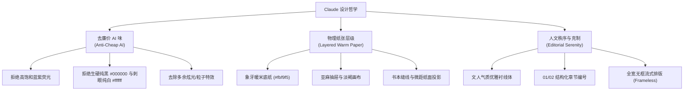

# Claude 风格界面设计系统全景深度指南

> **设计隐喻**：“如翻阅一本装帧考究的人文社科专著，在温润纸感与秩序感中沉浸思辨。”  
> Anthropic Claude 的设计语言以**温暖人文、克制优雅、纸质层级与极高信任感**为核心，彻底颠覆了传统科技产品冰冷的蓝紫科技调与廉价 AI 炫技感。

---

## 1. 核心设计哲学与品牌基因 (Philosophy & DNA)



### 1.1 拒绝“廉价科技 AI 味”
- **传统 AI 的误区**：滥用蓝紫极光渐变、荧光霓虹呼吸灯、强折射高光玻璃与漂浮发光边框，试图用“算力感”彰显存在感。
- **Claude 的反思**：AI 是用户的**思考延伸与研究智囊**。界面应当退居幕后，用温和的物理纸张触感消除用户的认知负荷与视觉疲劳。

### 1.2 物理纸张层级感 (Layered Paper Metaphor)
- **纸质表面递进**：底纸（暖米）→ 侧栏（亚麻）→ 画布（绘图纸）→ 卡片（象牙白）；
- **微距纸面投影**：模拟日光漫反射投下的超柔阴影（`0 1px 3px rgba(38, 28, 20, 0.04)`）；
- **书本缝线**：使用 `1px #e8e0d4` 极细微暖线代替生硬机械边框。

---

## 2. Warm Editorial 温暖色彩层级体系

> [!IMPORTANT]
> **黄金铁律**：严禁在暖色底纸上大面积出现刺眼的高反差纯白（`#ffffff`）硬色块！

| 角色 Token | 色值 HEX | 物理隐喻 | 典型应用场景 |
| :--- | :--- | :--- | :--- |
| `--glass-surface` | `#fbf9f5` | **暖米手工纸** | 应用全屏基底、主阅读工作台 |
| `--glass-surface-subtle` | `#f5efe6` | **温润亚麻纸** | 文献库左侧目录、侧边栏抽屉 |
| `--canvas` | `#f7f2ea` | **羊皮绘图底** | 思维导图画布背景、设置面板沉底区 |
| `--reader-stage` | `#ece5db` | **淡褐装订衬底** | PDF 阅读器外部舞台（衬托白色 PDF） |
| `--glass-card` | `#fdfcf9` | **柔和象牙白** | 浮动卡片、输入框、导图节点、表格行 |
| `--glass-border` | `#e8e0d4` | **书本压缝细线** | 1px 容器边缘、分隔细线、列表接缝 |
| `--coral` (Accent) | `#c15f3e` | **Anthropic 赤陶红** | 用户提问气泡、主按钮、活跃高亮标识 |
| `--ink` | `#262320` | **浓缩咖啡墨汁** | 主标题、段落正文、粗体核心概念 |
| `--muted` | `#78716c` | **风化铅笔灰** | 次级元数据、时间戳、页码标号、辅助提示 |

### Claude Cookbook 莫兰迪低饱和标签色谱
- **赤陶褐（Terracotta）**：背景 `#fbf0ea` / 边框 `rgba(193, 95, 62, 0.25)` / 文字 `#c15f3e`
- **鼠尾草绿（Sage Green）**：背景 `#edf4ee` / 边框 `#d2e5d5` / 文字 `#3d6d45`
- **灰岩蓝（Slate Blue）**：背景 `#edf2f7` / 边框 `#d0deec` / 文字 `#385d7f`
- **中性纸灰（Neutral Paper）**：背景 `#f4eee3` / 边框 `#e4ddd2` / 文字 `#6e655c`

---

## 3. 排版体系与文人衬线字阶 (Typography)

```
┌─────────────────────────────────────────────────────────────┐
│ 01 · 论证核心架构                                            │  [Serif 衬线体]
│ Methodological Backbone                                     │  Instrument Serif / Newsreader
├─────────────────────────────────────────────────────────────┤
│ Accurate mapping of the neural manifold space requires      │  [Sans-Serif 无衬线]
│ preserving the local topological neighborhood...            │  Inter / 系统现代黑体
├─────────────────────────────────────────────────────────────┤
│ [p. 4 · Theorem 2.1]   $$ \mathcal{L}_{reg} = \sum ... $$   │  [Mono & Math 等宽/公式]
│                                                             │  DM Mono / KaTeX
└─────────────────────────────────────────────────────────────┘
```

1. **标题衬线字体栈**：`"Instrument Serif", "Newsreader", "Tiempos Headline", "Georgia", "SongTi", serif`
   - 古典典雅，笔锋具有传统铅字印在湿润纸张上的墨晕质感。
2. **正文无衬线字体栈**：`-apple-system, BlinkMacSystemFont, "Inter", "PingFang SC", sans-serif`
   - 中性清爽，字怀开阔，确保长篇学术分析连续阅读 2 小时不眩晕。
3. **等宽与公式字体栈**：`"DM Mono", "JetBrains Mono", Consolas, monospace`
   - 用于 LaTeX 符号、页码引用 `p.3 · Figure 1` 与代码块。

---

## 4. 对话拓扑结构与流式排版 (Topology)

Claude 彻底打破了传统“双方各自套在小对话框里”的聊天模式：

```text
                                       ┌─────────────────────────────┐
                                       │ 08:24 You                   │
                                       │ 什么是神经流行降维的核心假设？ │ ── [User 提问]
                                       │ [p.2 · Section 3]           │    纯正赤陶红 (#c15f3e)
                                       └─────────────────────────────┘    靠右大圆角气泡 (18px 18px 4px 18px)
  Claude 3.7 Sonnet 08:25
  
  该论文的核心假设可以概括为以下三点：
  
  01. 神经响应的流形约束
  大脑皮层神经元的群体放电模式并非充满整个高维空间，而是局限在
  一个低维的平滑流形（Neural Manifold）上：
  
      $$ \mathcal{M} \subset \mathbb{R}^N, \quad \dim(\mathcal{M}) = d \ll N $$
  
  02. 拓扑同胚映射
  通过连续非线性激活函数，神经表征保留了物理刺激空间的局部邻域拓扑。   ── [Assistant 回答]
                                                                            全宽无框流式排版
                                                                            (Frameless Editorial)
  [跳到原文 ↗] [引用证据 (3)]                                                直接流淌在暖纸底色上
```

---

## 5. 组件原子规范与微交互 (Components & Interactions)

### 5.1 按钮与控制药丸 (Buttons & Pills)
- **Primary 胶囊**：`#c15f3e` 底色 + `#ffffff` 文字，`border-radius: 9999px`，悬浮微上浮 `-1px` 并伴随柔和赤陶光晕；
- **收起/展开微操作药丸**：使用高对比度横向 `◂ 收起`（赤陶色圆角药丸），拒绝弱对比浅灰字；
- **证据标签（Evidence Pills）**：`1px solid #e2dad0` 纸缝边框 + `#f4eee3` 底色；悬浮时边框与文字变为赤陶色、背景微亮为象牙白 `#fdfcf9`。

### 5.2 弹窗与菜单交互 (Click-Outside & Escape)
- 所有浮动菜单（如分支切换器 `Main discussion ▾`、筛选下拉）：
  - 点击页面任意空白处（Click Outside）**平滑自动收起**；
  - 按下键盘 **`Escape` 键秒级关闭**，绝不强制用户必须点击原按钮。

---

## 6. 五大设计反模式与避坑指南 (Anti-patterns)

| ❌ 常见误区 (Anti-Patterns) | ✅ Claude 规范做法 (Best Practices) |
| :--- | :--- |
| **误区 1**：侧边栏/抽屉背景使用 `#ffffff` 纯白 | 使用 `#f5efe6` 亚麻纸或 `#fbf9f5` 象牙暖色，杜绝反差眩光 |
| **误区 2**：滥用蓝紫极光与高饱和霓虹渐变 | 采用 `#c15f3e` 赤陶色配莫兰迪低饱和标签色 |
| **误区 3**：滥用强折射磨砂玻璃与高光光斑 | 禁用 specular sheen，使用纯物理纸面微投影 |
| **误区 4**：把 AI 的长篇回答框在小气泡里 | 采用全宽无框流式排版（Frameless Editorial） |
| **误区 5**：弹窗打开后只能点特定按钮关闭 | 支持点击遮罩空白与按 Esc 秒级平滑关闭 |

---

## 7. 现成 CSS Tokens 模板速查

```css
[data-theme="warm-editorial"] {
  /* 纸张表面体系 */
  --glass-surface: #fbf9f5;         /* 主底纸 */
  --glass-surface-subtle: #f4efe6;  /* 亚麻沉底纸 */
  --glass-card: #fdfcf9;            /* 象牙白卡片 */
  --glass-card-hover: #ffffff;      /* 悬浮微亮卡片 */
  --canvas: #f7f2ea;                /* 画布绘图纸 */
  --reader-stage: #ece5db;          /* 阅读器舞台装订衬底 */

  /* 边框细线体系 */
  --glass-border: #e8e0d4;          /* 书本细纸缝 */
  --glass-border-subtle: #f0ebe1;   /* 极淡分割线 */

  /* 墨水文字体系 */
  --ink: #262320;                   /* 浓缩咖啡墨黑 */
  --ink-secondary: #5c554e;         /* 次要文本灰 */
  --muted: #78716c;                 /* 标注元数据灰 */

  /* 品牌与强调色 */
  --coral: #c15f3e;                 /* Claude Terracotta 赤陶红 */
  --coral-hover: #b05232;           /* 悬浮深赤陶 */
  --coral-subtle: #fbf0ea;          /* 赤陶色微光浅底 */

  /* 字体栈 */
  --app-font-serif: "Instrument Serif", "Newsreader", "Tiempos Headline", "Georgia", serif;
  --app-font-sans: -apple-system, BlinkMacSystemFont, "Inter", "PingFang SC", sans-serif;
  --app-font-mono: "DM Mono", "JetBrains Mono", Consolas, monospace;

  /* 纸面柔和投影 */
  --paper-shadow-sm: 0 1px 3px rgba(38, 28, 20, 0.04);
  --paper-shadow-md: 0 4px 14px rgba(38, 28, 20, 0.07);
  --paper-shadow-lg: 0 12px 32px rgba(38, 28, 20, 0.12);
  --terracotta-glow: 0 2px 8px rgba(193, 95, 62, 0.28);
}
```
