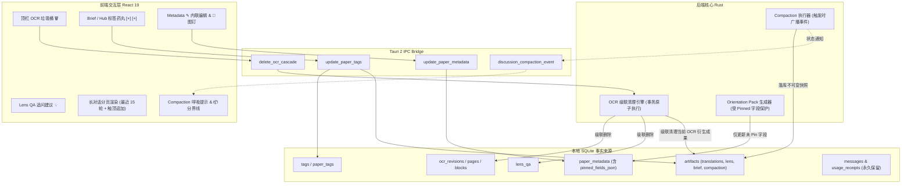

# Read Desktop V2 用户体验与后端深度强化设计规范

> 日期：2026-08-22  
> 状态：待用户最终确认（Approved in /grill-me, Pending Spec Review）  
> 关联文档：`docs/v2-product-spec-2026-08.md`, `docs/context-management.md`, `docs/backend-hardening.md`

---

## 1. 目标与背景

本项目为面向学术 PDF 的本地优先桌面阅读与研究工作台（Tauri 2 + React 19 + Rust + SQLite）。经过深入调研与 `/grill-me` 针对性讨论，本规范聚焦落实 6 个核心闭环与体验增强能力：

1. **OCR 删除与级联安全清理（OCR Cascade Deletion & Reset）**：在顶部 Reader 栏增加垃圾桶入口，配套严格的级联影响二次确认弹窗，原子清除 OCR 依赖资产并重置界面为待解析态，严格保留 PDF/Chat/Brief。
2. **Lens QA 引导式推荐提问（Suggested Questions）**：将模型在 Formula/Figure/Table Lens 中生成的 0~3 个启发式追问问题渲染为可点击药丸，点击后填入输入框（而非立即发送），方便读者微调与深度研讨。
3. **标签系统（Tags/Keywords）双向同步与 Takeaway 布局重构**：
   - Brief 中将学术标签云移至「💡 核心突破 (Takeaway)」正下方；
   - 标签支持就地添加与删除（`×` 药丸与 `+` 输入胶囊）；
   - Brief 标签与 Library Hub 文献卡片标签双向实时同步，并在 Hub 支持点击标签一键过滤。
4. **Metadata 手动编辑与图钉（📌 Pin）防覆写系统**：
   - Metadata 面板支持就地内联编辑（✎）；
   - 用户编辑保存后**自动钉住（Pin 锁定）**，亦可手动点击 📌 切换锁定/解锁；
   - 重新生成 Orientation Pack 时，严格跳过已锁定的字段，仅更新未锁定字段。
5. **长对话分批加载与时间线联动（Discussion Progressive Pagination）**：
   - 前端维护完整对话树，DOM 默认仅挂载渲染最近 15 轮（30 条）消息，彻底解决多 KaTeX 公式与长气泡带来的渲染卡顿；
   - 顶部提供「↑ 加载更早历史」按钮，支持触顶平滑自动加载；
   - 右侧 `ChatTimelineNavigator` 保持全局刻度，点击任意历史刻度自动按需加载并高亮定位。
6. **Compaction 上下文压缩透明感知（Context Compaction Visibility）**：
   - 后端压缩运行时通过事件下发 `compacting` 状态，前端展示呼吸动效提示「⚡ 正在压缩上下文中...」；
   - 消息流中插入优雅的 Liquid Glass 压缩分界线「📦 上下文已压缩 · 点击查看提炼摘要」，支持展开查阅不可变压缩 Artifact。

---

## 2. 架构与数据流设计



---

## 3. 各模块详细实现规范

### 3.1 OCR 级联删除与重置（OCR Cascade Deletion）

#### 3.1.1 触发与入口
- **Top Bar 位置**：在 `✓ OCR 就绪` 胶囊右侧嵌入 26px 极简毛玻璃垃圾桶图标按钮（`🗑️`），鼠标悬停显示 tooltip `删除当前 OCR 识别数据`。
- **Storage Drawer 位置**：在 Operations Drawer 的存储占用列表中，OCR 分项右侧亦提供删除图标。

#### 3.1.2 二次确认弹窗 `CascadeOcrDeleteConfirmModal.tsx`
- **统计并呈现受影响清单**：
  - ⚠️ **将彻底清除**：
    - 当前版本的全量 OCR 页面与选区框数据（`ocr_pages`, `ocr_blocks`）；
    - 依赖该 OCR 的翻译（Translation）与普通解释（Explanation）成果；
    - 所有 Lens（Formula, Figure, Table）成果及关联的局部 Lens QA 问答；
    - 锚定在当前 OCR Block 上的 Reading Guide 旁批数据；
  - 🛡️ **将严格安全保留**：
    - 原始 PDF 物理文件与 Document Revision；
    - 论文全篇 Brief、作者与期刊 Metadata、术语表与符号表；
    - Chat 全局研讨历史（消息已固化 `BlockQuoteSnapshot`，不会因 OCR 移除而断裂）；
    - 所有 Token 消耗与计费审计记录（`usage_receipts`）。
- **确认操作**：点击「确认级联删除」调用后端命令，清除加载状态，界面无缝切回 `⚡ OCR 解析` 待触发状态。

#### 3.1.3 后端 Rust 实现
- 新增命令：`delete_ocr_cascade(revision_id: String) -> AppResult<bool>`
- 数据库操作在 `IMMEDIATE` 事务中进行：
  ```sql
  DELETE FROM lens_qa WHERE lens_artifact_id IN (
    SELECT id FROM artifacts WHERE revision_id = ?1 AND ocr_revision_id IS NOT NULL
  );
  DELETE FROM artifacts WHERE revision_id = ?1 AND kind IN (
    'translation', 'explanation', 'lens_formula', 'lens_figure', 'lens_table', 'reading_guide'
  );
  DELETE FROM ocr_revisions WHERE revision_id = ?1;
  ```

---

### 3.2 Lens QA 引导式推荐提问（Suggested Questions）

#### 3.2.1 数据源
- 后端 Lens 生成的 schema 中已包含 `suggestedQuestions: string[]`（0~3 条）。
- 前端 `currentArtifact.content.suggestedQuestions` 提取该数组。

#### 3.2.2 交互逻辑
- 在 Lens QA 区域的输入胶囊上方渲染轻量级 Chip 列表：
  - 样式：`💡 追问建议：[问题 1] [问题 2] [问题 3]`。
  - 视觉：Liquid Glass 磨砂质感，11.5px 字号，悬停赤陶色微上浮动效。
- **点击行为**：
  - 将选中的问题文本填充至 `question` 状态中：`setQuestion(item)`；
  - 聚焦输入框 `textareaRef.current?.focus()`，光标移动至末尾；
  - **不直接发送**，给予用户二次编辑或补充提问的控制权。

---

### 3.3 标签（Tags/Keywords）双向同步与 Takeaway 重构

#### 3.3.1 布局调整（Brief）
- 在 `ArtifactPanel.tsx` 中：
  - 顶部首先渲染 `💡 核心突破 (Takeaway)` 醒目卡片；
  - 将 `Academic Keywords`（标签栏）放置在 Takeaway 核心突破的正下方；
  - 每个标签渲染为带轻量删除按钮的药丸：`[ 标签名 × ]`；
  - 标签行末尾放置 `+ 添加标签` 胶囊，点击展开为单行极简输入框（Enter 添加，Esc 取消，自动去重与 trim）。

#### 3.3.2 Library Hub 联动
- 在文献大厅的卡片与表格中：
  - 标签展示区悬停浮现 `×` 快捷删除；
  - 提供 `+` 胶囊支持快速为论文打标签；
  - **点击标签**：自动触发全局搜索框过滤该关键词（`setSearchQuery(tag)`），实现一键筛选同类文献。

#### 3.3.3 数据持久化
- 新增命令：`update_paper_tags(paper_id: String, tags: Vec<String>) -> AppResult<()>`
  - 同步更新最新 Brief Artifact 的 `content_json.keywords`；
  - 同步维护 SQLite `tags` 与 `paper_tags` 关联表；
  - 前端即时更新 `selectedDoc.keywords` 与 `documents` 列表。

---

### 3.4 Metadata 手动编辑与图钉 📌 防覆写系统

#### 3.4.1 数据结构与字段
- 扩展 `paper_metadata`（或在 `metadata_json` 内维护 `_pinned: string[]`）：
  - 监控字段：`title`, `authors`, `publicationYear`, `venue`, `doi`, `abstract`。
- 新增命令：`update_paper_metadata(revision_id: String, metadata: Value, pinned_fields: Vec<String>) -> AppResult<()>`。

#### 3.4.2 交互逻辑
- 在 `ArtifactPanel.tsx` 的 Metadata 视图中：
  - 悬停字段浮现 `✎`（编辑）和 `📌`（图钉）；
  - 点击 `✎` 切换为就地内联输入框（支持多行摘要或单行字段），Enter/失焦自动保存；
  - **自动钉住**：用户手动保存任何字段后，该字段的 `pinned` 状态自动变为 `true`，图钉变为实体高亮态；
  - **手动点击 📌**：可自由切换该字段的锁定/解锁状态；
  - 解锁态图钉显示为淡灰色描边，锁定态显示为高亮主题色（赤陶红）。

#### 3.4.3 后端生成防覆写机制
- 在 `run_orientation_generation` 落库更新 `paper_metadata` 前：
  - 查询当前 `revision_id` 已锁定的 `pinned_fields`；
  - 针对处于 `pinned_fields` 中的字段，**跳过模型生成的返回值，保留数据库中的用户修改值**；
  - 仅对未锁定的字段应用模型提取的最新数据。

---

### 3.5 讨论长历史分批加载（Discussion Progressive Pagination）

#### 3.5.1 渲染分批策略
- 前端 State 仍然从 SQLite 接收完整 `messages` 列表以保持全局一致性。
- 引入 `visibleTurnLimit`（默认初始值为 **15 轮**，即 30 条消息）。
- `visibleDiscussion` 计算属性根据 `visibleTurnLimit` 仅提取末尾 N 轮节点传递给 DOM 渲染。

#### 3.5.2 滚动与加载交互
- **顶部加载按钮**：消息流顶部若存在更早消息，渲染 Liquid Glass 按钮：`↑ 加载更早的 15 轮研讨（剩余 M 轮）`。
- **触顶自动加载**：滚动容器监听 `onScroll`，当 `scrollTop < 40px` 时自动触发 `setVisibleTurnLimit(prev => prev + 15)`，并记录高度差保持滚动位置不跳动。
- **时间线 Mini-Map 联动**：
  - 右侧 `ChatTimelineNavigator` 刻度轴依然基于全量 `messages` 绘制全部刻度；
  - 当用户点击了尚未渲染在 DOM 中的早期刻度时，自动将 `visibleTurnLimit` 扩展至覆盖该节点，并平滑定位至对应消息气泡。

---

### 3.6 Compaction 上下文压缩的前端透明感知

#### 3.6.1 运行时状态广播
- 后端在 `discussion_needs_compaction` 判定成立并启动 `compact_discussion` 时：
  - 通过 Tauri AppHandle 发送事件 `discussion_compaction_started`；
  - 完成后发送 `discussion_compaction_finished`。
- 前端状态机捕获后，在输入胶囊上方显示发光呼吸徽章：
  - `⚡ 正在压缩长对话上下文（提炼核心论点与关键引用）...`。

#### 3.6.2 对话流压缩分界线（Compaction Divider）
- 当一条 Assistant 消息是从 Compaction 续接生成时（可在 `Message.usage` 或 `parentId` 追溯到 `context_compaction` Artifact）：
  - 在该消息气泡正上方渲染一条高质感分界线：
    `── 📦 上下文已压缩 · 核心论点已提炼 [查看摘要 ▾] ──`；
  - 点击「查看摘要」可就地展开一个轻量级 Liquid Glass 卡片，呈现结构化压缩总结（`summary_markdown`、核心发现与待解问题），使模型上下文演化完全透明可追溯。

---

## 4. 验证与测试计划

### 4.1 单元测试与组件测试
1. **OCR 级联清理测试**：
   - 验证 `delete_ocr_cascade` 命令在删除 OCR 后，`artifacts` 中的翻译/Lens 及 `lens_qa` 正确级联清除，而 `messages`、`brief`、`paper_metadata` 完好无损。
2. **标签双向同步测试**：
   - 验证在 Brief 中删除/添加标签后，`DocumentCard` 与 Library Hub 同步更新；
   - 验证在 Hub 中添加标签后，Brief 视图同步更新。
3. **Metadata 钉住防覆写测试**：
   - 用户编辑标题并锁定，模拟重新触发 Orientation Pack，验证生成的标题被忽略，用户标题被保留。
4. **长对话分批加载测试**：
   - 模拟 50 条消息的 Discussion，验证初始仅渲染 30 条；点击加载更多或点击早期刻度后完整展开。
5. **Lens QA Suggested Questions 测试**：
   - 验证点击问题 Chip 后正确填入 textarea 并获得焦点，不触发 `onAskLens`。

### 4.2 串行验证命令
```powershell
npm run build
npx vitest run --maxWorkers=1 --fileParallelism=false
npx tsc -b
cd src-tauri
cargo check --locked
cargo test --locked
```
